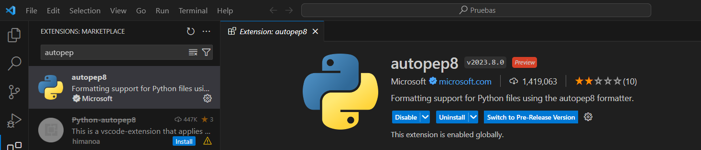
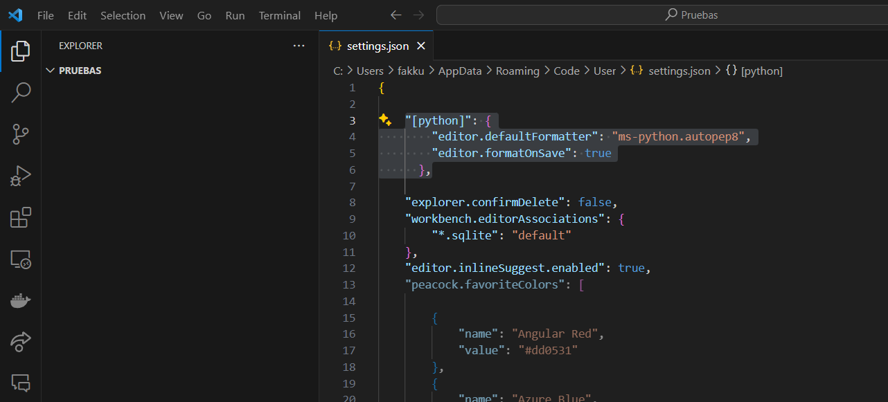

# Utilización de la extensión PEP 🚀

Las **PEP** son las Propuestas de Mejora de Python.
La extensión **autopep8** proporciona una integración **fácil** y **rápida** con las PEP. Esta extensión es una herramienta de formateo de código Python según las convenciones de estilo de PEP 8.

1. Nos dirigimos al apartado de extensiones en VS Code y instalamos la extensión `autopep8` 
    <!-- Agregado: Captura de pantalla para ilustrar la instalación de la extensión -->

2. Colocamos F1 o (Ctrl + Shift + P) y seleccionamos:
   ```bash
   Preferences: Open User Settings (JSON)
    ```
    Presionamos **Enter** y se abrirá un archivo llamado ``settings.json``.
<br>

3. En este archivo, agregamos el siguiente código (como se ve en la imagen):
    ```
    "[python]": {
            "editor.defaultFormatter": "ms-python.autopep8",
            "editor.formatOnSave": true
          },
    ```
    
4. Guardamos el documento y ya tendremos el formateo automático del código en Python al guardar. 🎉 