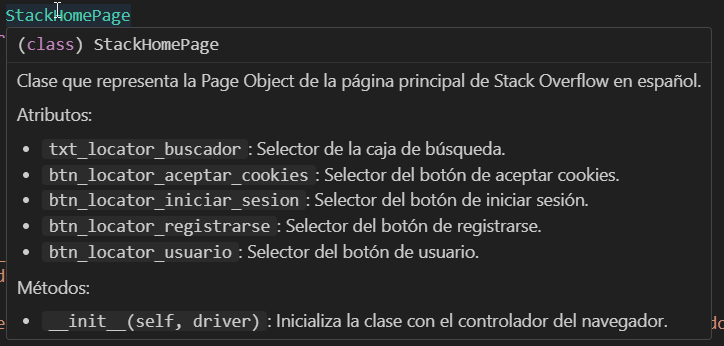

# Buenas practicas en Python
Este documento tiene como objetivo establecer pautas y normas que deben seguirse al desarrollar y mantener el código fuente del proyecto. Al finalizar el documento, tendremos un checklist que nos permitirá evaluar estas prácticas y asegurarnos de la calidad del código.


- ### Nombres de Variables y Funciones

    Los nombres de las funciones y variables deben ser descriptivos y expresar claramente su propósito.
    
    - Malo:
    ```python
    def cookies(self):
        if self.driver.find_element(*self.locator_cookies).is_displayed():
            self.driver.find_element(*self.locator_cookies).click()
    ```
    Notemos que tanto el nombre de la clase como la variable, no nos indican con claridad que es lo que hacen o represetan
    - Bueno:
    ```python
    def click_aceptar_cookies(self):
        if self.driver.find_element(*self.btn_aceptar_cookies).is_displayed():
            self.driver.find_element(*self.btn_aceptar_cookies).click()
    ```
    Al definir variables mas claras, hacemos que nuestro codigo sea mas claro y legible


    ##### Aqui van algunos tips para la creacion de nombres de variables
    1. Que el nombre describa claramente su proposito
    2. Evitar Utilizar abreviaturas que generen confusion y si se utilizan, que sean pactadas por el equipo de trabajo
    3. Mantener una Consistencia, si utilizamos camelCase para una variables, utilizar esta para todos


    ##### tips para nombre de funciones
    1. Nombres de funciones que describan claramente la acción que realizan. Una buen nombre de funcion debe ser Autoexplicativa
    2. Las funciones deben hacer una cosa y hacerla bien
    3. Seguir las convenciones de nomenclatura de Python, que utiliza sanke_case para funciones
    Esto quiere decir que cada espacion, se remplaza con un `_`

- ### Funciones pequeñas y con unica responsabilidad

    Las funciones deben ser cortas y realizar una única tarea. Esto facilita la comprensión y el mantenimiento del código.

    - Malo:
    ```python
    def buscar(self, texto):
        # limpiar caja de busqueda
        txt_caja_busqueda = self.driver.find_element(*self.buscador)
        txt_caja_busqueda.clear()

        # Ingresar texto
        txt_caja_busqueda.send_keys(texto)

        # Presionar Enter
        txt_caja_busqueda.send_keys(Keys.ENTER)

    ```
    - Bueno:
    ```python
    def limpiar_caja_busqueda(self):
        self.driver.find_element(*self.buscador).clear()
    
    def ingresar_texto_caja_busqueda(self,texto):
        self.driver.find_element(*self.buscador).send_keys(texto)

    def presionar_enter_caja_busqueda(self):
        self.driver.find_element(*self.buscador).send_keys(Keys.ENTER)
    ```

- ### Evitar Comentarios Obvios
    Evitar comentarios innecesarios cuando el código es claro por sí mismo.
    - Malo
    ```python
    #locator de boton para registrarse
    btn_registrarse = (By.XPATH, "//a[normalize-space()='Registrarse']")
    ```
    - Bueno:"
    ```py
    btn_registrarse = (By.XPATH, "//a[normalize-space()='Registrarse']")
    ```

- ### Documentar cada Page Object
    La documentación es esencial para garantizar la comprensión y el mantenimiento del código.
    A la hora de escribir un nuevo test nos sirve tener documentado cada **Page** ya que si colocamos el mause arriba de una funcion o clase documentada, nos aparecera lo siguiente
    

    Si bien la documentacion a menudo depende de las preferencias del equipo y las conveciones del proyecto hay algunas practicas que son comunes entre los distintos proyectos

    1. **Documentación en la Clase**:
        - Descripción de la Clase: Proporciona una visión general de lo que representa la clase.
        - Métodos de la Clase: Incluye una descripción breve de cada método, sus parámetros, tipo de retorno y ejemplos de uso.

        Ejemplo:
        ```python
        class StackHomePage:
        """
        Clase que representa la Page Object de la página principal de Stack Overflow en español.

        Atributos:
        - `txt_buscador`: Selector de la caja de búsqueda.
        - `btn_aceptar_cookies`: Selector del botón de aceptar cookies.
        - `btn_iniciar_sesion`: Selector del botón de iniciar sesión.
        - `btn_registrarse`: Selector del botón de registrarse.
        - `btn_usuario`: Selector del botón de usuario.

        Métodos:
        - `__init__(self, driver)`: Inicializa la clase con el controlador del navegador.
        """            
        ```
        

    2. **Documentación en Cada Función**:
        - Descripción de la Función: Proporciona detalles sobre lo que hace la función.
        - Parámetros: Describe cada parámetro y su propósito.
        - Tipo de Retorno: Indica el tipo de objeto que la función devuelve.
        - Ejemplo de Uso: Proporciona ejemplos prácticos de cómo llamar a la función.

        Ejemplo:

        ```py
        def __init__(self, driver):
        """
        Inicializa la clase con el controlador del navegador.

        :param driver: Instancia del controlador del navegador.
        """
        self.driver = driver

        @allure.step("Buscamos el texto \"{texto}\" en la caja de búsqueda")
        def buscar(self, texto: str) -> None:
            """
            Realiza una búsqueda en la caja de búsqueda.

            :param texto: Texto a buscar.
            """
            WebDriverWait(self.driver, 10).until(
                EC.visibility_of_element_located(self.buscador)
            )
            self.driver.find_element(*self.buscador).send_keys(texto)
            with allure.step("Presionamos la tecla ENTER"):
                self.driver.find_element(*self.buscador).send_keys(Keys.ENTER)
        ```
        


## Entonces podemos verificar nuestro codigo con el siguiente checklist

- [ ] Nombres de Variables
- [ ] Nombre de Funciones claras
- [ ] Funciones pequeñas y con unica responsabilidad
- [ ] Evitar Comentarios Obvios
- [ ] Clases Documentadas con descripcion , atributos y funciones(opcional)
- [ ] Funciones Documentadas con descripcion, parametro, tipo de dato de retorno y      
    ejemplo de uso(opcional)