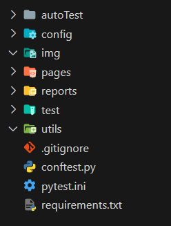
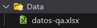
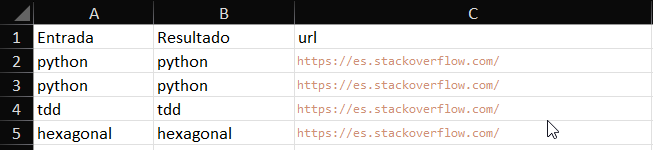

<div style="text-align: right;">
  
</div>

# Data driven 
En pocas palabras, es un enfoque en el cual los datos de prueba estan separados del código de prueba y se almacenan en archivos externos o bases de datos. 

Ahora bien, nuestro proyecto habia quedado con la siguiente estructura:



Vamos a agregar una carpeta llamada `Data` y en esta colocaremos nuestros datos de prueba en un archivo ``.xlsx`` 



En esta carpeta pondremos los datos que necesiten nuestros test por ejemplo



Para utilizar estos datos debemos agregar una clase que maneje el acceso a estos, para eso crearemos un archivo en la carpeta `utils` con el nombre `data_driven.py` con el siguiente contenido:

```python
import openpyxl

class DatosConfig:
    def __init__(self, ambiente):
        self.ambiente = ambiente

    def obtener_datos_xlsx(self, nombre_hoja):
        """
        Método para obtener los datos de la hoja de excel\n
        Ejemplo de uso:\n
        datos = DatosConfig("qa")\n
        datos.obtener_datos("Sheet1")\n
        este método retorna una lista con los datos de la hoja de excel
        """
        # Cargar el archivo de excel
        rutaArchivo = f"data/datos_{self.ambiente}.xlsx"
        print(rutaArchivo)
        archivo = openpyxl.load_workbook(rutaArchivo)
        hoja = archivo[nombre_hoja]

        # Obtener los datos de la hoja
        datos = []
        for fila in hoja.iter_rows(min_row=2, max_row=hoja.max_row, min_col=1, max_col=hoja.max_column):
            fila = [celda.value for celda in fila]
            datos.append(fila)

        return datos
```

Ahora bien, teniendo esta clase que nos provee los datos, lo vamos a consumir en el test, agregando:

```py
def datos_ambiente():
    ambiente = os.getenv("ambiente")
    datos = DatosConfig(ambiente)
    return datos.obtener_datos_xlsx("Sheet1")
```
**os.getenv("ambiente")**: devuelve el valor de la variable de entorno con nombre "ambiente"

quedando nuestro test de a siguiente manera:

```python
import pytest
import allure
from pages.stack_home_page import StackHomePage
from pages.stack_result_page import StackResultPage
from utils.data_driven import DatosConfig
import os
from config.browser import BrowserConfig


def datos_ambiente():
    ambiente = os.getenv("ambiente")
    datos = DatosConfig(ambiente)
    return datos.obtener_datos_xlsx("Sheet1")


class Test:
    """
    Clase para realizar las pruebas de la página de Stack Overflow en español.
    """


    @allure.title("Validar Busqueda desde la caja de texto")
    @allure.description(
        "Validar que la caja de texto funcione correctamente realizando una busqueda y validando el resultado"
    )
    @pytest.mark.noprod
    @pytest.mark.parametrize("busqueda, resultado, url", datos_ambiente())
    def test_validar_caja_texto_nuevo(self, driver, busqueda, resultado, url):
        """
        Test para validar la funcionalidad de la caja de búsqueda.
        """
        with allure.step("Nos dirigimos a la pagina Stack Overflow en español"):
            driver.get(url)

        home_page = StackHomePage(driver)
        home_page.click_aceptar_cookies()
        home_page.limpiar_caja_busqueda()
        home_page.buscar(busqueda)
        result_page = StackResultPage(driver)
        result_page.validar_contenido_URL(resultado)


    @allure.title("Validar redireccion a la página de usuarios")
    @allure.description("Validar que se redireccione a la página de usuarios")
    @pytest.mark.smoke
    @pytest.mark.parametrize("url, contenido", [("https://es.stackoverflow.com/","users")])
    def test_ir_usuarios(self, driver, url, contenido):
        """
        Test para verificar la navegación a la página de usuarios.
        """
        with allure.step("Nos dirigimos a la pagina Stack Overflow en español"):
            driver.get(url)
        home_page = StackHomePage(driver)
        home_page.click_aceptar_cookies()
        home_page.click_usuarios()
        result_page = StackResultPage(driver)
        result_page.validar_contenido_URL(contenido)


if __name__ == "__main__":
    pytest.main()
```
**@pytest.mark.parametrize("busqueda, resultado, url", datos_ambiente())**: La funcion ``datos_ambiente()`` devuelve una matriz, y lo que hace el parametrize, es.. a cada fila la desestructura en las 3 variables que estan definidas en la cadena de caracteres y va a ejecutar esa prueba, la misma cantidad de veces como columnas tenga la matriz

```
datos = [
    ("python","python","https://es.stackoverflow.com/"),
    ("tdd","tdd","https://es.stackoverflow.com/"),
    ("hexagonal","hexagonal","https://es.stackoverflow.com/"),
]
```

Ahora, esto no es suficiente, ya que nuestro objetivo es tomar el ambiente por parametro, y esto ya vimos como hacerlo, cuando declaramos el --browser, repetirmos esto y agregaremos una funcion para asignar esa variable de entorno local
En nuestro archivo `conftest.py`

```python
# conftest.py
import pytest
from config.browser import BrowserConfig
import os


def pytest_addoption(parser):
    """
    Agregar opciones de línea de comandos para seleccionar el navegador
    """
    parser.addoption("--browser", action="store", default="chrome",
                     help="Escoger navegador: chrome o edge")
    parser.addoption("--ambiente", action="store", default="qa",
                     help="Escoger el ambiente de ejecución: qa o prod")


def pytest_configure(config):
    os.environ["ambiente"] = config.getoption("ambiente")
    os.environ["browser"] = config.getoption("browser")


@pytest.fixture(autouse=True)
def driver(request):
    """
    Fixture para inicializar el driver del navegador
    """
    driver = BrowserConfig(os.getenv("browser")).select_browser()
    driver.maximize_window()

    yield driver  # Retorna el objeto driver para que esté disponible en las pruebas

    print("Cerrar Browser")
    driver.quit()
```
1. Agregamos **parser.addoption**, para cachear la variable pasada por linea de comando --ambiente

2. Agregamos el hook de configuracion para asignar el valor asignado por parametro a una nueva variable de entorno local (esta variable se crea al comienzo de ejecucion y se elimina al finalizar la ejecucion final del test)

Con esto podemos probar si nuestros nuestro test de la siguiente manera

```bash
python -m pytest --browser=chrome --ambiente=qa
```

----
<div style="display: flex; justify-content: space-between;">
  <div>
    <p>Ing. Fanny Montoya</p>
  </div>
  <div>
    <p>testingsoftwarearg@gmail.com</p>
  </div>
</div>

