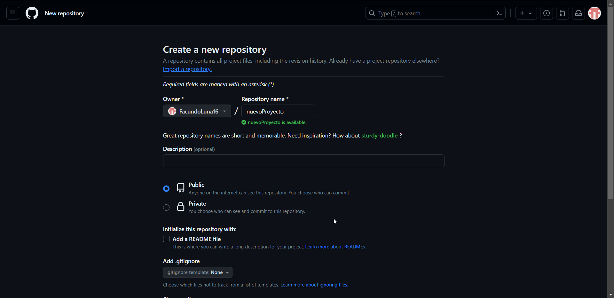
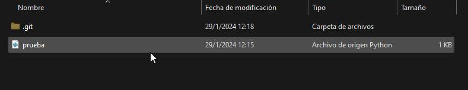
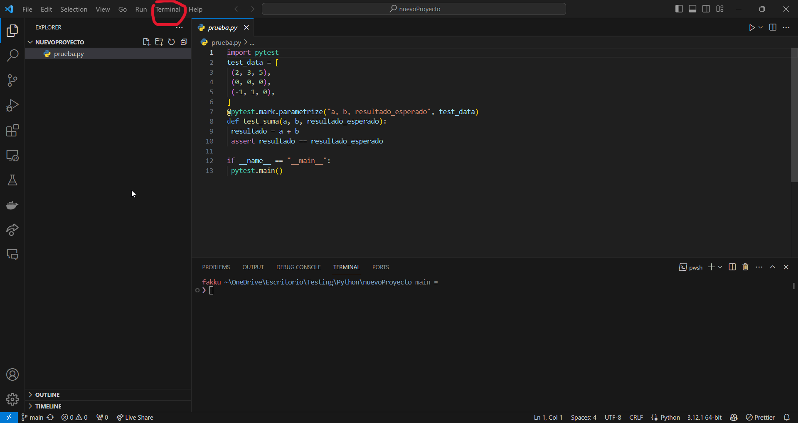
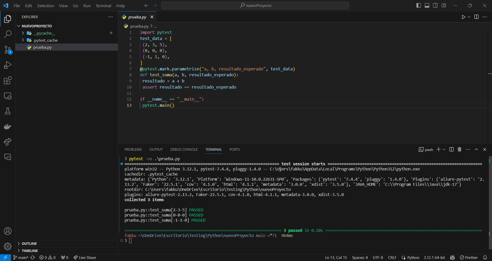

# 🆙🔼 Subir Proyecto de Python a GitHub

## Crear un Repositorio en GitHub

1. Inicia sesión en GitHub.
2. En la esquina superior Izquierda, haz clic en el icono "new" 

3. Configura la información del repositorio, como nombre, descripción y configuraciones opcionales.

4. Haz clic en "Crear repositorio".

## Configurar Git en tu Proyecto Local

Existen varias formas de configurar el proyecto, el sitio de github al crearlo te suguire 2 formas. Primero nos ubicamos en la raiz de nuestro proyecto

### Forma 1: Crear un nuevo proyecto desde linea de comandos

- Ejecuta los siguientes comandos para inicializar un repositorio Git local y configurar la conexión con el repositorio remoto de GitHub:

```bash
echo "# nuevoProyecto" >> README.md
git init
git add README.md
git commit -m "Nuevo proyecto..."
git remote add origin https://github.com/FacundoLuna16/nuevoProyecto.git
git push -u origin master
```
Aveces puede que te solicite las credenciales de GitHub para conectarte.

### Forma 2: Subir un proyecto existente desde linea de comando
Este caso, es si tenemos un proyecto ya de git creado en nuestra maquina local y queremos subirlo a GitHub, solo debemos ejecutar el comando 
```bash
git remote add origin https://github.com/FacundoLuna16/nuevoProyecto.git
git push -u origin master
```

### Otra forma de subir un proyecto 
En ocasiones una forma mas sencilla es clonar el repositorio y arrastrar el proyecto a esa carpeta.

```bash
git clone https://github.com/FacundoLuna16/nuevoProyecto.git
```
> el formato del comando es `git clone <URL del proyecto>`

Este comando nos creara una carpeta con el nombre del proyecto, como se ve en la siguiente imagen.


vamos a crear un script en python para subir a este repositorio, reutilizaremos una funcion que vimos anteriormente en datos externos, con el nombre prueba.py

```python
import pytest
test_data = [
 (2, 3, 5),
 (0, 0, 0),
 (-1, 1, 0),
]
@pytest.mark.parametrize("a, b, resultado_esperado", test_data)
def test_suma(a, b, resultado_esperado):
 resultado = a + b
 assert resultado == resultado_esperado
 
if __name__ == "__main__":
 pytest.main()
```

- Arrastramos este archivo a la carpeta clonada




- Abrimos la terminal y colocamos los siguientes comandos

```bash
git add prueba.py
git commit -m "nuevo Proyecto"
git push
```

> Se puede colocar **`git add .`** para añadir todos los cambios en un commit.

y con esto, nuestro GitHub quedaria con el nuevo proyecto subido.


### Clonando el repositorio de cero y ejecutando

- Clonamos el repositorio con 
```bash
git clone https://github.com/FacundoLuna16/nuevoProyecto.git
```

Podemos abrir Visual Estudio Code desde la terminal con el comando

```bash
code .
```
Esto nos abrira el VS Code con la carpeta donde estamos ubicados

- Abrimos la termianl que nos provee VS Code seleccionando la opcion de `terminal` que aparece en las opciones del menu superior



colocamos en esta terminal:
```bash
pytest -vs .\prueba.py
```
esto nos ejecuta el test, como se ve en la imagen


