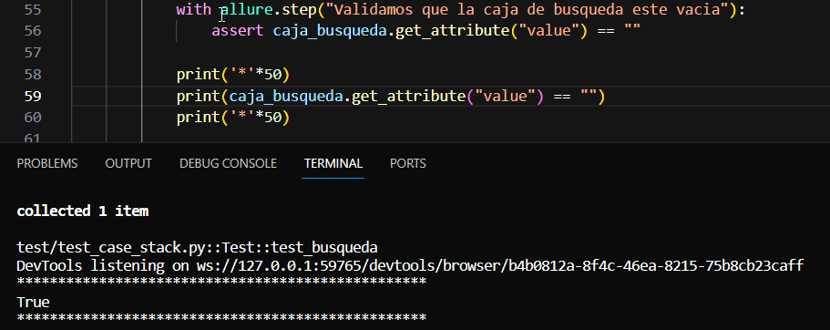
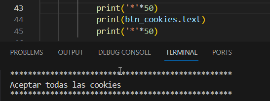
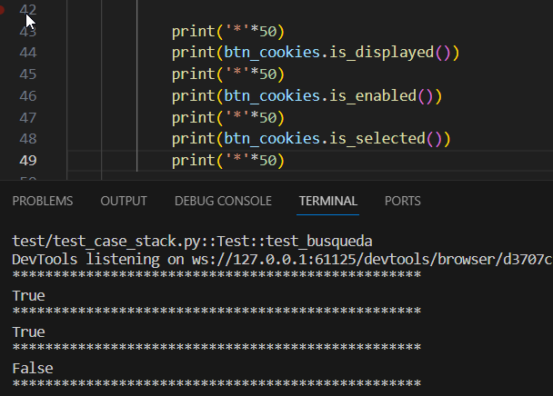

# Funciones para elementos webdriver
En todos los ejemplos siguientes vamos a estar utilizando como base el proyecto de stack overflow:
```python
txt_locator_caja_busqueda = (By.XPATH, "//input[@name='q']")
btn_locator_aceptar_cookies = (
        By.XPATH, "//button[@id='onetrust-accept-btn-handler']")
driver = webdriver.Chrome(
        service=Service(ChromeDriverManager().install())
    )
txt_caja_busqueda =  driver.find_element(*txt_locator_caja_busqueda)
btn_aceptar_cookies = (driver.find_element(*btn_locator_aceptar_cookies))
```

- #### Metodos de Interaccion:
    1. **txt_caja_busqueda.clear()**  =>  Borra el texto si es un elemento de entrada de texto.
    2. **btn_aceptar_cookies.click()**  => Hace un click al elemento
    3. **txt_caja_busqueda.send_keys(texto)**  => Introduce en el elemento el texto pasado por parametro


- #### Metodos para obtener Atributos:
    1. **txt_caja_busqueda.get_attribute(nombreAtributo)** =>  se utiliza para obtener el valor de un atributo específico del elemento.
        ```python
        value = txt_caja_busqueda.get_attribute("value")

        # verificando si la caja esta vacia
        assert txt_caja_busqueda.get_attribute("value") == ""
        ```
        
        Otro ejemplo puede ser obtener el atributo ``href`` de un enlace:
        ```python
        link_element = driver.find_element(By.XPATH, "//a[@id='mi_enlace']")
        href_value = link_element.get_attribute("href")
        ```
        Este devolverá la URL que tiene el elemento
        <br>
    2. **get_property(property_name)**  =>se utiliza para obtener el valor de una propiedad específica del elemento.
    Por ejemplo, saber el estado de un check
        ```python
        checked_estado = checkbox_element.get_property("checked")
        ```

    3. **text** => devuelve el texto visible en el elemento. se puede usar directamente sin necesidad de un método.
        ```python
        valor = btn_cookies.text
        ```
        

- #### Metodos de Espera:
    1. **is_displayed()**: Devuelve True si el elemento está visible en la página.

    2. **is_enabled()**: Devuelve True si el elemento está habilitado.
    3. **is_selected()**: Devuelve True si el elemento está seleccionado (útil para casillas 
    de verificación y botones de opción como radio_button).

    
    > nota: la funcion **is_selected()** da falso, ya que se esta probando sobre un elemento que no tiene un estado de "seleccionado" o "no seleccionado".
    >Este deberia utilizarse en elementos web como check o radio button.

Para ampliar les dejamos documentacion [Aqui](https://selenium-python.readthedocs.io/api.html#module-selenium.webdriver.remote.webelement)