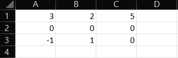
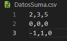
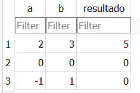

# 💾 Manejo de Datos Externos con Python
En este documento, exploraremos diversas formas de utilizar datos externos en Python, abarcando desde el acceso a bases de datos relacionales como MySQL y SQLite, hasta la extracción de información desde archivos de texto plano como ``.xlsx`` o ``.csv``, entre otros. Además, examinaremos la posibilidad de simular datos utilizando un decorador proporcionado por Pytest conocido como @pytest.mark.parametrize.

***
> ## Acceso a datos con `@pytest.mark.parametrize`

Pytest proporciona el decorador @pytest.mark.parametrize, el cual nos permite pasarle un conjunto de datos en forma de arreglo. Este decorador desestructura automáticamente las tuplas contenidas en el arreglo en variables individuales. Para ilustrarlo mejor veamos el siguiente ejemplo:

```python
import pytest

test_data = [
    (2, 3, 5),
    (0, 0, 0),
    (-1, 1, 0),
]
```
En este arreglo, cada tupla contiene tres parámetros; los dos primeros representan las variables a operar, mientras que el tercero es el resultado esperado de la operación.

Podemos utilizar esta estructura para definir una función de prueba que evalúe la suma de estos números:

```python
@pytest.mark.parametrize("a, b, resultado_esperado", test_data)
def test_suma(a, b, resultado_esperado):
    resultado = a + b
    assert resultado == resultado_esperado
```

En este ejemplo, la función ``test_suma`` se ejecutará para cada conjunto de datos proporcionado en ``test_data``. Los valores de ``a`` y ``b`` se tomarán de las primeras y segundas posiciones de cada tupla, respectivamente, mientras que ``resultado_esperado`` se extraerá de la tercera posición. *La aserción al final de la función verifica si la suma de a y b coincide con el resultado esperado*

> Recordatorio: necesitas tener pytest instalado, puedes hacerlo con **pip install pytest** en tu terminal

el ejemplo para ejecutarlo en tu manquina quedaria asi

```python
import pytest

test_data = [
    (2, 3, 5),
    (0, 0, 0),
    (-1, 1, 0),
]

@pytest.mark.parametrize("a, b, resultado_esperado", test_data)
def test_suma(a, b, resultado_esperado):
    resultado = a + b
    assert resultado == resultado_esperado
    
if __name__ == "__main__":
    pytest.main()
```

***

> ## Acceso a datos desde un archivo ``.xlsx``

Python nos ofrece la biblioteca ``openpyxl`` para acceder a datos en un archivo Excel ``.xlsx``. Asegúrate de tener la biblioteca instalada:

```bash
pip install openpyxl
```

para obtener el archivo .xlsx podemos utilizar el metodo `load_workbook('nombre_archivo.xlsx')`
```python
import openpyxl

workbook = openpyxl.load_workbook('tu_archivo.xlsx')

# Seleccionar la hoja de trabajo
sheet = workbook['Nombre_de_la_hoja']

# Acceder a datos en una celda específica
valor = sheet['A1'].value
```

pero veamoslo con un ejemplo mas practico, vamos a seguir con el ejemplo de la suma.Tenemos un archivo ``.xlsx``, llamado "DatosSuma.xlsx"  con los siguientes datos 



vamos a definir una funcion para obtener los datos de este archivo


```python
import openpyxl

def cargar_valores_desde_excel(ruta_archivo):
    workbook = openpyxl.load_workbook(ruta_archivo)

    sheet = workbook['Sheet1']

    datos = []

    for row in sheet.iter_rows(min_row=1, max_row=sheet.max_row, min_col=1, max_col=sheet.max_column):
        fila = [cell.value for cell in row]
        datos.append(fila)
    return datos

def test_suma():
    ruta_archivo = 'DatosSuma.xlsx'
    datos = cargar_valores_desde_excel(ruta_archivo)

    for fila in datos:
        a, b, resultado_esperado = fila
        resultado = a + b
        if resultado == resultado_esperado:
            print(f"La suma de {a} + {b} es igual a {resultado}")
        else:
            print(f"La suma de {a} + {b} es distinta a {resultado_esperado}")

if __name__ == "__main__":
    test_suma()

```

Utilizamos **sheet.iter_rows** para iterar sobre las filas de la hoja, especificando el rango de filas y columnas. En este caso, estamos iterando sobre las filas desde la 1 hasta la máxima fila y desde la columna 1 hasta la máxima columna. A estos valores los almacenamos en el arreglo `datos`, no debe quedar 

datos = ``[[3, 2, 5], [0, 0, 0], [-1, 1, 0]]``

> para ejecutar este codigo podemos hacerlo con **py ejemploSuma.py** [asumiendo ese nombre de archivo]

pero ahora vamos a juntar lo que aprendimos al inicio de este documento, vamos a fusionar la entrada de datos de texto plano con el decorador ``@pytest.mark.parametrize``

```python
import openpyxl
import pytest
import warnings
warnings.filterwarnings("ignore", category=DeprecationWarning)


def cargar_valores_desde_excel(ruta_archivo):
    workbook = openpyxl.load_workbook(ruta_archivo)

    sheet = workbook['Sheet1']

    datos = []

    for row in sheet.iter_rows(min_row=1, max_row=sheet.max_row, min_col=1, max_col=sheet.max_column):
        fila = [cell.value for cell in row]
        datos.append(fila)
    return datos


@pytest.mark.parametrize("a, b, resultado_esperado", cargar_valores_desde_excel('DatosSuma.xlsx'))
def test_suma(a, b, resultado_esperado):
    resultado = a + b
    assert resultado == resultado_esperado, f"Falla para a={a}, b={b}. Resultado obtenido: {resultado}, Resultado esperado: {resultado_esperado}"


if __name__ == "__main__":
    pytest.main()
```

**import warnings**: esto lo hacemos para ignorar unas advertencias de la libreria de openpyx, que no son relevantes en estas pruebas

**cargar_valores_desde_excel** :  esta funcion sigue teniendo el mismo comportamiento que antes

Estamos utilizando el decorador **@pytest.mark.parametrize** para parametrizar los casos de prueba directamente desde el archivo ``.xlsx``, evitando la necesidad de la función de prueba anterior. Además, se ha añadido una aserción para verificar la igualdad de los resultados obtenidos y esperados.

> para ejecutar este codigo podemos utilizar ``python -m pytest .\ejemploSuma.py``
> o **pytest -v -s .\ejemploSuma.py** --- es mas completa!
> **-v** : Aumenta la verbosidad, lo que significa que proporcionará más información sobre las pruebas mientras se ejecutan. 
> **-s** : Desactiva la captura de salida estándar. Esto significa que cualquier salida estándar (por ejemplo, la salida de print en tu código) se mostrará en la consola en tiempo real. 


***

> ## Acceso a datos desde un archivo ".csv"

Para acceder a datos desde un archivo CSV, podemos utilizar el módulo csv de Python.
podemos hacer una funcion en la que obtengamos los datos del archivo



quedando la funcion de la siguiente manera:

```python
import csv

def cargar_valores_desde_csv(ruta_archivo):
    with open(ruta_archivo, newline='') as archivo_csv:
        lector_csv = csv.reader(archivo_csv)
        datos = []
        for fila in lector_csv:
            nueva_fila = []
            for valor in fila:
                nueva_fila.append(int(valor))
            datos.append(nueva_fila)
    print(datos) # [[2, 3, 5], [0, 0, 0], [-1, 1, 0]] 

if __name__ == "__main__":
    cargar_valores_desde_csv('DatosSuma.csv')
```

- Abrimos el archivo CSV utilizando `with` open para garantizar la correcta gestión de recursos.
- `as` es el nombre que le daremos al archivo en el codigo
-  Creamos un objeto lector de CSV usando `csv.reader`
- Iteramos sobre cada fila del archivo CSV y convertimos cada valor a entero antes de agregarlo a una nueva fila.

> en vez de utilizar dos for anidados podemos usar la compresión de listas quedando **datos = [[int(numero) for numero in fila] for fila in lector_csv]**

como podemos observar, podemos hacer lo mismo que hicimos con los datos del archivo `.xlsx`, utilizandolos como parametros en el decorador **@pytest.mark.parametrize**


***

> ## Acceso a datos desde una base de datos

Podemos utilizar bibliotecas como sqlite3 para acceder a una base de datos SQLite. Asegúrate de tener la biblioteca instalada:

```bash
pip install db-sqlite3
```

en la que podemos utiliazarla como una clase que facilita el acceso a una base de datos SQLite. 

```python
import sqlite3

class BaseDatosSQLite:
    def __init__(self, nombre_archivo):
        self.nombre_archivo = nombre_archivo
        self.conexion = sqlite3.connect(nombre_archivo)
        self.cursor = self.conexion.cursor()

    def ejecutar_consulta(self, consulta, parametros=()):
        self.cursor.execute(consulta, parametros)
        return self.cursor.fetchall()

    def cerrar_conexion(self):
        self.conexion.close()

    def obtener_datos_tabla(self):
        consulta_sql = "SELECT a, b, resultado FROM suma"
        return self.ejecutar_consulta(consulta_sql)
```

para probar esta clase podemos crear una funcion de la siguiente manera

```python
def ejemplo_uso_sqlite():
    base_datos = BaseDatosSQLite('datosSuma.db')

    try:
        datos_tabla = base_datos.obtener_datos_tabla()
        print(datos_tabla)
    finally:
        base_datos.cerrar_conexion()
```

Utilizamos `try-finally` para colocar lo que queremos hacer dentro del bloque `try` y una vez finalizado se ejecuta automaticamente `finally`, lo que nos permite cerrar la conexion con la base de datos de manera segura, incluso si ocurren excepciones durante la ejecución.

para pobrar el codigo podemos crear un archivo que nos genere la base de datos ejecutando el siguient script 

```python
import sqlite3

# Conectar a la base de datos
conexion = sqlite3.connect('datosSuma.db')
cursor = conexion.cursor()

# Crear la tabla si no existe
cursor.execute('''
    CREATE TABLE IF NOT EXISTS suma (
        a INTEGER,
        b INTEGER,
        resultado INTEGER
    )
''')

# Insertar datos
cursor.execute("INSERT INTO suma (a, b, resultado) VALUES (2, 3, 5)")
cursor.execute("INSERT INTO suma (a, b, resultado) VALUES (0, 0, 0)")
cursor.execute("INSERT INTO suma (a, b, resultado) VALUES (-1, 1, 0)")

# Confirmar los cambios y cerrar la conexión
conexion.commit()
conexion.close()
```
con esta quedara la base de datos creada de la siguiente manera



y el codigo anterior en un solo archivo llamado `ejemploSuma.py` quedaria:

```python
import sqlite3

class BaseDatosSQLite:
    def __init__(self, nombre_archivo):
        self.nombre_archivo = nombre_archivo
        self.conexion = sqlite3.connect(nombre_archivo)
        self.cursor = self.conexion.cursor()

    def ejecutar_consulta(self, consulta, parametros=()):
        self.cursor.execute(consulta, parametros)
        return self.cursor.fetchall()

    def cerrar_conexion(self):
        self.conexion.close()

    def obtener_datos_tabla(self):
        consulta_sql = "SELECT a, b, resultado FROM suma"
        return self.ejecutar_consulta(consulta_sql)

def ejemplo_uso_sqlite():
    base_datos = BaseDatosSQLite('datosSuma.db')

    try:
        datos_tabla = base_datos.obtener_datos_tabla()
        print(datos_tabla)
    finally:
        base_datos.cerrar_conexion()

if __name__ == '__main__':
    ejemplo_uso_sqlite()
```

> podemos ejecutarlo colocando en la terminal  **py .\ejemploSuma.py**

cunando lo ejecutamos obtenemos 

```bash
❯ py .\ejemploSuma.py
[(2, 3, 5), (0, 0, 0), (-1, 1, 0)]
```

y como en los anteriores podemos utilizar **@pytest.mark.parametrize** para utilizar estos datos en nuestros test