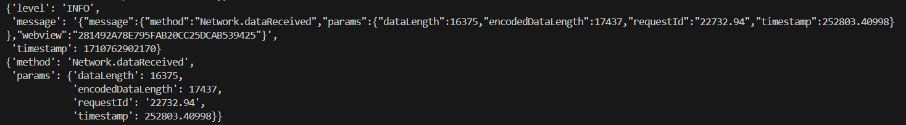
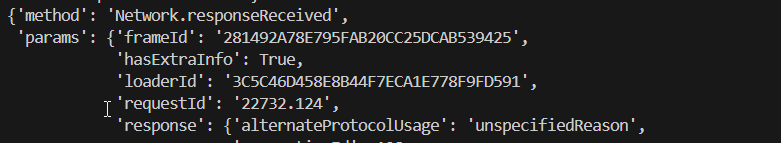
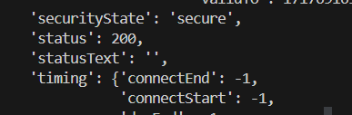

# Manejo de Trafico Web (Network)
En este documento exploraremos la forma de acceder a los datos de red, para esto debemos primero configurar nuestro navegador

### Configuracion del navegador
En cada uno de los navegadores que tengamos configurado en nuestro archivo de configuracion de browser llamado `browser.py` debemos agregarle lo siguiente:
```python
chrome_options = webdriver.ChromeOptions()
chrome_options.set_capability("goog:loggingPrefs", {"performance": "ALL"})
```
``chrome_options = webdriver.ChromeOptions()``: Creamos un objeto que representara las opciones del navegador (como pueden ser los distintos logs, o que la ventana se ejecute en segundo plano, etc)

`set_capability`: Seteamos las capacidades que queremos que tenga nuesto navegador

`"performance": "ALL"`: En esta linea le indicamos que se registren todas las entradas de rendimiento, tales como tiempos de carga, **eventos de carga**, etc
En el caso de querer ejecutarlo en segundo plano lo unico que debemos hacer es añadirlo:
```py
chrome_options.add_argument("--headless")
```
Una vez seteado las opciones, debemos pasarle esta configuracion en la creacion del driver

```python
driver = webdriver.Chrome(service=Service(
                ChromeDriverManager().install()), options=chrome_options)
```

Por lo tanto nuestro archivo browser.py nos queda de la siguiente manera:
```python
# browser.py
from selenium import webdriver
from webdriver_manager.chrome import ChromeDriverManager
from webdriver_manager.firefox import GeckoDriverManager
from webdriver_manager.microsoft import EdgeChromiumDriverManager as EdgeDriverManager
from selenium.webdriver.chrome.service import Service
import os


class BrowserConfig:
    """
    Clase para configurar el navegador que se usará en las pruebas.
    ejemplo:
    browser = BrowserConfig('chrome').select_browser()
    """

    def __init__(self, browser=os.getenv("browser")):
        self.BROWSER = browser
        self.driver = None

    def select_browser(self):
        """
        Método para seleccionar el navegador que se usará en las pruebas.
        """

        if self.BROWSER == 'firefox':
            firefox_options = webdriver.FirefoxOptions()
            firefox_options.set_capability("goog:loggingPrefs", {"performance": "ALL"})
            # firefox_options.add_argument("--headless")
            self.driver = webdriver.Firefox(
                service=Service(GeckoDriverManager().install()), options=firefox_options)

        elif self.BROWSER == 'chrome':
            chrome_options = webdriver.ChromeOptions()
            chrome_options.set_capability("goog:loggingPrefs", {"performance": "ALL"})
            self.driver = webdriver.Chrome(service=Service(
                ChromeDriverManager().install()), options=chrome_options)

        elif self.BROWSER == 'chrome-headless':
            chrome_options = webdriver.ChromeOptions()
            chrome_options.set_capability("goog:loggingPrefs", {"performance": "ALL"})
            chrome_options.add_argument("--headless")
            self.driver = webdriver.Chrome(service=Service(
                ChromeDriverManager().install()), options=chrome_options)

        elif self.BROWSER == 'edge':
            edge_options = webdriver.EdgeOptions()
            edge_options.set_capability("goog:loggingPrefs", {"performance": "ALL"})
            # edge_options.add_argument("--headless")
            self.driver = webdriver.Edge(service=Service(
                EdgeDriverManager().install()), options=edge_options)

        else:
            raise ValueError(f'--browser="{self.BROWSER}" no esta definido')

        return self.driver
```
Con esto tenemos nuestro navegador configurado

### Creacion de la clase de manejo de trafico

Una vez configurado nuestro navegador, vamos a crear una clase que maneje estos datos de red
para esto debemos acceder a los logs de performance de nuestro navegador.

Para mostrar su funcionamiento vamos a crear una funcion para obtener los registros de red
```python
def obtener_registros(self) -> dict:
        """
        Método para obtener los registros de rendimiento de una página web.
        """
        registros = self.driver.get_log("performance")


        solicitudes_respuestas = {}

        for registro in registros:
            entrada = json.loads(registro["message"])["message"]
            if "Network.response" in entrada["method"] or "Network.request" in entrada["method"]:
                id_solicitud = entrada["params"]["requestId"]
                respuesta = entrada.get("params", {}).get("response", {})
                url = respuesta.get("url", "")
                estado = respuesta.get("status", "")
                solicitudes_respuestas[id_solicitud] = {
                    "url": url, "estado": estado}

        return solicitudes_respuestas
``` 

## <span style="color: red;">Importante</span> configurar el navegador
``driver.get_log("performance")``= Obtiene los logs del tipo performance (si no tenemos la configuracion del navegador nos dara un error, ya que no estan por defecto)



``json.loads(registro["message"])["message"]`` = convertimos en json el resultado de **registros** y accedemos al valor que tiene en ``"message"`` 


` if "Network.response" in entrada["method"]` : preguntamos si el metodo es del tipo response o request para filtrar los logs de red
y obtenemos sus resultados



#### Entonces nos queda la clase de la siguiente manera

```python
#manejoTraficoWeb.py
import json

class ManejoTraficoWeb:
    """
    Clase para manejar el tráfico web de una página web.
    """

    def __init__(self, driver):
        self.driver = driver

    def obtener_registros(self) -> dict:
        """
        Método para obtener los registros de rendimiento de una página web.
        """
        registros = self.driver.get_log("performance")


        solicitudes_respuestas = {}

        for registro in registros:
            entrada = json.loads(registro["message"])["message"]
            if "Network.response" in entrada["method"] or "Network.request" in entrada["method"]:
                id_solicitud = entrada["params"]["requestId"]
                respuesta = entrada.get("params", {}).get("response", {})
                url = respuesta.get("url", "")
                estado = respuesta.get("status", "")
                solicitudes_respuestas[id_solicitud] = {
                    "url": url, "estado": estado}

        return solicitudes_respuestas

    def limpiar_registros(self) -> None:
        """
        Método para limpiar los registros de rendimiento de una página web.
        """
        self.driver.execute_script("return window.performance.clearResourceTimings();")

    def cantidad_registros_por_status(self, status, registros) -> int:
        """
        Método para obtener la cantidad de registros 404.
        """
        cantidad = 0

        for id_solicitud, respuesta in registros.items():
            if respuesta["estado"] == status:
                cantidad += 1

        return cantidad
   
```
y podemos añadir un test para probarlo

```python
    def test_1(self, driver):
        driver.get("https://es.stackoverflow.com/")
        manejo_trafico = ManejoTraficoWeb(driver)
        home_page = StackHomePage(driver)
        home_page.click_aceptar_cookies()
        registros = manejo_trafico.obtener_registros()
        contador = len(registros)
        manejo_trafico.limpiar_registros()
        home_page.click_usuarios()
        registros = manejo_trafico.obtener_registros()
        #pprint.pprint(registros)
        print(manejo_trafico.cantidad_registros_por_status(200, registros))
```