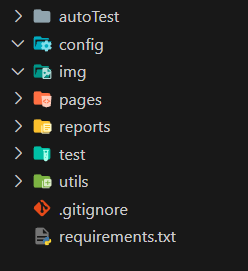
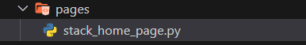
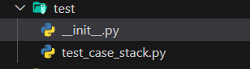
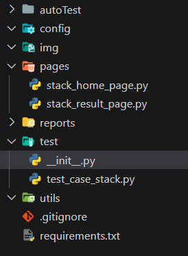
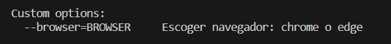
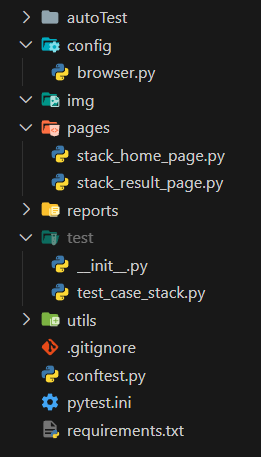

# Page Object

Como su nombre lo indica, Page Object es una página tratada como objeto, normalmente conocido como un patrón de diseño utilizado en entornos de prueba de interfaces de usuario. Su objetivo es abstraer la interfaz a través de clases, las cuales proporcionan ciertos comportamientos. Esto tiene algunas ventajas, como:

1. **Abstracción de la Interfaz de Usuario:** Como dijimos anteriormente, encapsulamos la interfaz de una aplicación o página web, en nuestro caso. Esta representa una página y ofrece métodos que representan las acciones que puede realizar.

2. **Reusabilidad:** No está de más aclarar que al encapsular la página en una clase, podemos reutilizarla en otras test suites.

3. **Mantenimiento Sencillo:** Esto se debe a que si la página cambia en algún aspecto, solo debemos modificar los "locators" de cada una, sin modificar nuestros tests.

4. **Legibilidad del Código:** Como veremos más adelante en este documento, nos permiten escribir test suites con mayor legibilidad del código.


Continuamos en donde dejamos el proyecto anterior con la siguiente estructura


A nuestro test suite de stack vamos a separarlo en page object, vamos a armar una clase que representara el home de **Stack Overflow**

A esta clase la vamos a crear en la carpeta `page` con el nombre sugerido **stack_home_page.py**


colocaremos el siguiente codigo:

```python
from selenium.webdriver.common.by import By
from selenium.webdriver.common.keys import Keys
from selenium.webdriver.support.ui import WebDriverWait
from selenium.webdriver.support import expected_conditions as EC
import allure


class StackHomePage:
    """
    Clase que representa la Page Object de la página principal de Stack Overflow en español.
    """
    txt_locator_buscador = (By.XPATH, "//input[@name='q']")
    btn_aceptar_cookies = (
        By.XPATH, "//button[@id='onetrust-accept-btn-handler']")
    btn_iniciar_sesion = (By.XPATH, "//a[normalize-space()='Iniciar sesión']")
    btn_registrarse = (By.XPATH, "//a[normalize-space()='Registrarse']")
    btn_usuario = (By.CSS_SELECTOR, "#nav-users")

    def __init__(self, driver):
        self.driver = driver

    @allure.step("Hacemos clic en el botón de aceptar cookies")
    def click_aceptar_cookies(self):
        """
        Método para hacer clic en el botón de aceptar cookies.
        """
        WebDriverWait(self.driver, 10).until(
            EC.visibility_of_element_located(self.btn_aceptar_cookies)
        )
        if self.driver.find_element(*self.btn_aceptar_cookies).is_displayed():
            self.driver.find_element(*self.btn_aceptar_cookies).click()

    @allure.step("limpiamos el contenido de la caja de búsqueda")
    def limpiar_caja_busqueda(self):
        """
        Método para limpiar el contenido de la caja de búsqueda.
        """
        WebDriverWait(self.driver, 10).until(
            EC.visibility_of_element_located(self.txt_locator_buscador)
        )
        self.driver.find_element(*self.txt_locator_buscador).clear()

    @allure.step("buscamos el texto \"{texto}\" en la caja de búsqueda")
    def buscar(self, texto):
        """
        Método para realizar una búsqueda en la caja de búsqueda.
        """
        WebDriverWait(self.driver, 10).until(
            EC.visibility_of_element_located(self.txt_locator_buscador)
        )
        self.driver.find_element(*self.txt_locator_buscador).send_keys(texto)

        with allure.step("presionamos la tecla ENTER"):
            self.driver.find_element(*self.txt_locator_buscador).send_keys(Keys.ENTER)

    @allure.step("Hacemos clic en el botón para redirigirnos a la página de usuarios")
    def click_usuarios(self):
        """
        Método para dirigirse a la sección de usuarios.
        """
        WebDriverWait(self.driver, 10).until(
            EC.visibility_of_element_located(self.btn_usuario)
        )
        if self.driver.find_element(*self.btn_usuario).is_displayed():
            self.driver.find_element(*self.btn_usuario).click()
            print("Hacemos clic en el botón de usuarios")
        else:
            print("El botón de usuarios no está visible")

    @allure.step("Verificamos que la URL contenga el texto esperado")
    def verificar_contenido_URL(self, texto):
        """
        Método para verificar que la URL contenga el texto esperado.
        """
        WebDriverWait(self.driver, 10).until(
            EC.url_contains(texto)
        )
        assert texto in self.driver.current_url, f"La URL no contiene el texto {
            texto}"
```

>- **@allure.step** : es un decorador que nos permite comentar la funcion y visualizarla en allure

y vamos a crear otra clase que representara el resultado de esta busqueda, con un nombre sugerido **stack_result_page.py**
con el siguinte codigo:
```python
import allure


class StackResultPage:
    """
    Clase que representa la Page Object de la página de resultados de Stack Overflow en español.
    """

    def __init__(self, driver):
        self.driver = driver

    @allure.step("Validamos que el texto \"{texto}\" se encuentre en la URL")
    def validar_contenido_URL(self, texto):
        """
        Método para validar que el texto dado está presente en la URL actual.
        """
        assert texto in self.driver.current_url, f"El valor {
            texto} no se encuentra en la URL"
```

una vez agregado esta 2 clases, debemos modificar nuestro test suite, quedando de la siguiente manera:

```python
import pytest
import allure
from selenium import webdriver
from webdriver_manager.chrome import ChromeDriverManager
from selenium.webdriver.chrome.service import Service
from pages.stack_home_page import StackHomePage
from pages.stack_result_page import StackResultPage


class Test:

    @pytest.fixture(autouse=True)
    def setup_teardown(self):
        self.driver = webdriver.Chrome(
            service=Service(ChromeDriverManager().install())
        )
        self.driver.maximize_window()
        self.driver.get("https://es.stackoverflow.com/")

        yield  # Lo que este despues de yield se ejecuta despues de cada test

        print("Cerrar Browser")
        self.driver.quit()

    @allure.title("Validar Busqueda desde la caja de texto")
    @allure.description(
        "Validar que la caja de texto funcione correctamente realizando una busqueda y validando el resultado"
    )
    def test_validar_caja_texto_nuevo(self):
        """
        Test para validar la funcionalidad de la caja de búsqueda.
        """
        with allure.step("Nos dirigimos a la pagina Stack Overflow en español"):
            self.driver.get("https://es.stackoverflow.com/")
        home_page = StackHomePage(self.driver)
        home_page.click_aceptar_cookies()
        home_page.limpiar_caja_busqueda()
        home_page.buscar("python")
        result_page = StackResultPage(self.driver)
        result_page.validar_contenido_URL("python")


if __name__ == "__main__":
    pytest.main()
```

#<span style="color:red">Importante!</span> 
Dentro de la carpeta `test` debemos agregar un **archivo vacio** con el nombre `__init__.py`, el cual indica que el directorio debe ser tratado como un paquete y, por lo tanto, permitir la importación de módulos desde ese directorio.
> En el caso que en nuestras page utilizaramos algun modulo externo de nuestro codigo, como metodos utiles, deberiamos agregar el `__init__.py` en la carpeta `page`



Entonces nos queda nuestro proyecto de la siguiente manera:


Ejecutamos con 
```bash
pytest -vs .\test\test_case_stack.py --alluredir reports/allure-results
```


## Agregamos archivo pytest.ini y conftest.py
primero debemos entender que es el archivo pytest.ini y conftest.py

**pytest.ini**: es un archivo de configuración para Pytest.
    este tiene algunas configuraciones de utilidad

1. Markers:permiten etiquetar tus pruebas con información adicional. Puedes luego       
    seleccionar o excluir pruebas según estos marcadores.
    Colocando en el archivo el siguiente codigo
    ```ini
    [pytest]
    markers =
        noprod: marca las pruebas que no se ejecutan en produccion
        smoke: marca las pruebas como parte de la suite de humo
    ```
    Para marcar una funcion con cada etiqueta lo que debemos hacer es agregar un decorador en el test que corresponde a esa etiqueta, como por ejemplo:
    ```python
    @pytest.mark.noprod
    def test_no_production_code():
    #resto del codigo
    ```
    Para ejecutar las pruebas que tienen la etiqueta **noprod** colocamos
    ```bash
    pytest -k noprod
    ```
    Si queremos ejecutar todas las pruebas que no son de la etiquetra **noprod**
    ```bash
    pytest -k "not noprod"
    ```
    **Si no le paso parametro, se ejecutan todas**
    
2. Rutas de búsqueda:personalizar las rutas de búsqueda de Python para que Pytest pueda  
    encontrar tus módulos y paquetes.
    ```ini
    [pytest]
    python_paths = test/
    ```

3. Opciones de línea de comandos predeterminadas: Nos permite establecer opciones de     
    línea de comandos predeterminadas en el pytest.ini. Esto puede ahorrarte tiempo al 
    ejecutar pruebas comunes:

    ```ini
    [pytest]
    addopts = -p no:warnings -v -s -q --alluredir reports/allure-results
    ```
    `-p no:warnings`: Desactiva la impresión de advertencias durante la ejecución de las pruebas.
    
    `-v`: Activa el modo detallado
    
    `-s`: Desactiva la captura de la salida estándar, permitiendo que la salida de las pruebas se muestre directamente en la consola.(esto quiere decir que los `print` se mostraran en tiempo real y no al final de la prueba)

    `-q`: Activa el modo silencioso (quiet). Reduce la cantidad de información que se muestra en la consola durante la ejecución de las pruebas
    
    `--alluredir reports/allure-results`:Especifica el directorio donde se deben guardar los resultados de Allure
4. Timeouts: Podemos establecer límites de tiempo para la ejecución de pruebas. 
    ```ini
    [pytest]
    timeout = 10
    ```
    significa que si una prueba excede 10 segundos, se abortará y se considerará fallida.


Entre otros...

>podemos obtener mas informacion [Aqui](https://docs.pytest.org/en/stable/reference/customize.html) sobre los archivos de configuracion
> y sobre el detalle de las configuraciones [Aqui](https://docs.pytest.org/en/6.2.x/reference.html#ini-options-ref)

### <span style="color:green">Podemos agregar entonces en la raiz de nuestro proyecto el siguiente codigo</span>
```ini
[pytest]
addopts = -p no:warnings -v -s -q --alluredir reports/allure-results
generate_report_on_test = True
python_paths = ./test/
markers =
    noprod: marca las pruebas que no se ejecutan en produccion
    smoke: marca las pruebas como parte de la suite de humo
``` 

**conftest.py**: es un archivo especial que se utiliza para compartir configuración, accesorios y fixtures entre múltiples archivos de prueba.
Algunas Opciones que podemos utilizar:

- **Definicion de Fixture**: Las fixtures son funciones que proporcionan datos o 
    recursos para nuestras pruebas.
    Ejemplo:
    ```python
    # conftest.py
    import pytest

    @pytest.fixture
    def example_data():
        return [1, 2, 3]
    ```
    Luego en nuestras pruebas los podemos llamar, colocando el nombre de la funcion utilizada en el archivo ``conftest.py`` pasado como parametro en la funcion donde lo vamos a utilizar, por ejemplo
    ```python
    #test_suma_array.py
    def test_using_fixture(example_data):
    assert sum(example_data) == 6
    ```

- **Hooks**:

    - ``pytest_addoption(parser)``:Es un hook de Pytest que te permite agregar opciones de línea de comandos
    Nosotros lo utilizaremos para pasar por consola el browser
    ```python
    # conftest.py
    def pytest_addoption(parser):
    parser.addoption("--browser", action="store", default="chrome",
                     help="Escoger navegador: chrome o edge")
    ```
    El primer parametro el lo que debemos colocar en la terminal, seguido del valor de esa parametro por ejemplo
    ```bash
    pytest --browser=edge
    ```
    El segundo parametro ``action="store"``, indica que el valor proporcionado en la línea de comandos para esa opción se debe almacenar y asociar con el nombre de la opción.(esto es para poder llamarlo luego)

    El tercer parametro, asigna por defecto un valor 
    
    Por ultimo da una opcion de help por si nos olvidamos que opciones puede recibir
    si colocamos en la terminal ``Pytest --help`` dentro de todas las opciones que nos permite pytest, nos aparecera la que acabamos de personalizar
        
    
> Mas informacion sobre **Hooks** en ``conftest.py`` [Aqui](https://docs.pytest.org/en/6.2.x/reference.html#hooks) 

###Nosotros utilizaremos el siguiente codigo en nuestro conftest.py

```python
# conftest.py
import pytest
from webdriver_manager.chrome import ChromeDriverManager
from webdriver_manager.microsoft import EdgeChromiumDriverManager
from selenium.webdriver.chrome.service import Service
from selenium import webdriver


def pytest_addoption(parser):
    """
    Agregar opciones de línea de comandos para seleccionar el navegador
    """
    parser.addoption("--browser", action="store", default="chrome",
                     help="Escoger navegador: chrome o edge")


@pytest.fixture(autouse=True)
def driver(request):
    """
    Fixture para inicializar el driver del navegador
    """
    browser = request.config.getoption("--browser")

    driver = None

    if browser == "chrome":
        driver = webdriver.Chrome(service=Service(
            ChromeDriverManager().install()))
    elif browser == "edge":
        driver = webdriver.Edge(service=Service(
            EdgeChromiumDriverManager().install()))
    else:
        raise ValueError("Navegador no soportado")

    driver.maximize_window()

    yield driver  # Retorna el objeto driver para que esté disponible en las pruebas

    print("Cerrar Browser")
    driver.quit()
```
``raise`` es una palabra reservada en Python. Se utiliza para generar una excepción de manera explícita como :

- ValueError
- TypeError
- NameError
- ZeroDivisionError
- etc.


Pero a raiz de este cambio debemos modificar nuestro test, para que reciba como paremtro el driver, quedando el archivo `test_case_stack.py` de la siguiente manera:
```python
import pytest
import allure
from pages.stack_home_page import StackHomePage
from pages.stack_result_page import StackResultPage


class Test:
    """
    Clase para realizar las pruebas de la página de Stack Overflow en español.
    """

    @allure.title("Validar Busqueda desde la caja de texto")
    @allure.description(
        "Validar que la caja de texto funcione correctamente realizando una busqueda y validando el resultado"
    )
    @pytest.mark.noprod
    def test_validar_caja_texto_nuevo(self, driver):
        """
        Test para validar la funcionalidad de la caja de búsqueda.
        """
        with allure.step("Nos dirigimos a la pagina Stack Overflow en español"):
            driver.get("https://es.stackoverflow.com/")
        home_page = StackHomePage(driver)
        home_page.click_aceptar_cookies()
        home_page.limpiar_caja_busqueda()
        home_page.buscar("python")
        result_page = StackResultPage(driver)
        result_page.validar_contenido_URL("python")

    @allure.title("Validar redireccion a la página de usuarios")
    @allure.description("Validar que se redireccione a la página de usuarios")
    @pytest.mark.smoke
    def test_ir_usuarios(self, driver):
        """
        Test para verificar la navegación a la página de usuarios.
        """
        with allure.step("Nos dirigimos a la pagina Stack Overflow en español"):
            driver.get("https://es.stackoverflow.com/")

        home_page = StackHomePage(driver)
        home_page.click_aceptar_cookies()
        home_page.click_usuarios()

        result_page = StackResultPage(driver)
        result_page.validar_contenido_URL("users")


if __name__ == "__main__":
    pytest.main()
```

Ejecutamos con:
```bash
pytest --browser=chrome
```

En el caso de querer correr solo los test con etiqueta noprod
```
pytest --browser=edge -k noprod
```
> o con el navegador de su eleccion (recordar agregarlo como opcion)


## Mejorando parte del codigo
Notemos que en nuestro archivo `conftest.py` tenemos una estructura case que instancia el browser elegido... pero lo mas apropiado seria que una clase se encarge de esto, ya que son elementos de un browser, enconces lo encapsulamos en una nueva clase llamada `BrowserConfig` con el siguiente codigo:
Creamos un archivo con el nombre `browser.py` dentro de la carpeta config
y colocamos
```python
# browser.py
from selenium import webdriver
from webdriver_manager.chrome import ChromeDriverManager
from webdriver_manager.firefox import GeckoDriverManager
from webdriver_manager.microsoft import EdgeChromiumDriverManager as EdgeDriverManager
from selenium.webdriver.chrome.service import Service


class BrowserConfig:
    """
    Clase para configurar el navegador que se usará en las pruebas.
    ejemplo:
    browser = BrowserConfig('chrome').select_browser()
    """

    def __init__(self, browser):
        self.BROWSER = browser
        self.driver = None

    def select_browser(self):
        """
        Método para seleccionar el navegador que se usará en las pruebas.
        """
        self.browser = self.BROWSER
        if self.browser == 'firefox':
            self.driver = webdriver.Firefox(
                service=Service(GeckoDriverManager().install()))
        elif self.browser == 'chrome':
            self.driver = webdriver.Chrome(service=Service(
                ChromeDriverManager().install()))
        elif self.browser == 'chrome-headless':
            self.driver = webdriver.Chrome(executable_path=ChromeDriverManager().install(),
                                           options=self.chrome_headless_options())
        elif self.browser == 'edge':
            self.driver = webdriver.Edge(service=Service(
                EdgeDriverManager().install()))
        else:
            raise ValueError(f'--browser="{self.browser}" no esta definido')

        return self.driver
```

Por lo que nuestro ``conftest.py`` nos quedaria de la siguiente manera:

```python
# conftest.py
import pytest
from config.browser import BrowserConfig


def pytest_addoption(parser):
    parser.addoption("--browser", action="store", default="chrome",
                     help="Escoger navegador: chrome o edge")


@pytest.fixture(autouse=True)
def driver(request):

    browser_selecionado = request.config.getoption("--browser")

    browser = BrowserConfig(browser_selecionado)
    driver = browser.select_browser()
    driver.maximize_window()

    # Retorna el objeto driver para las pruebas que lo necesiten (yield es como un return pero no cierra el driver)
    yield driver

    print("Cerrar Browser")
    driver.quit()
```


Con el cual ejecutaremos de la siguiente forma:

- si dejamos por default chrome: 
    ```bash
    pytest
    ```
- Si decidimos ejecutar con otro browser:
    ```pytest
    pytest --browser=edge
    ```

Nuestro proyecto debe quedar armado de la siguiente manera:
