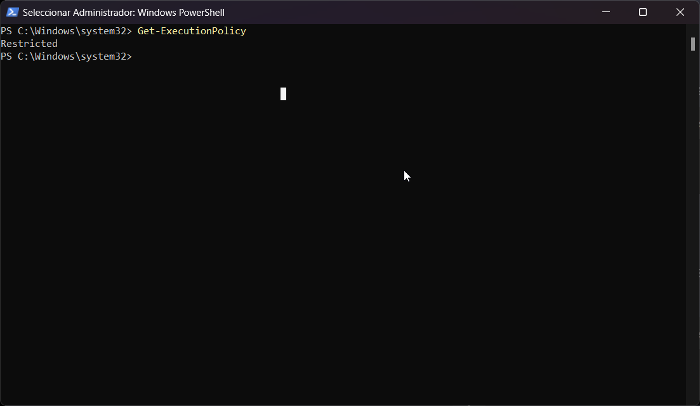
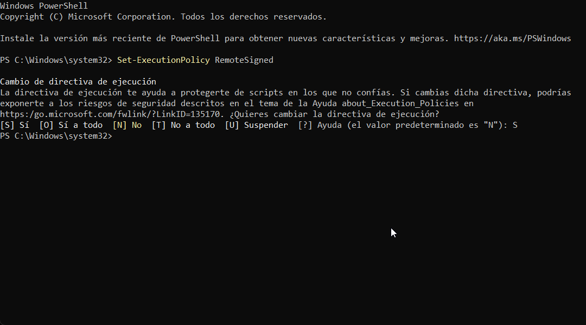

# Habilitar ejecucion de scripts en nuestro sistema

1. Abre PowerShell como administrador:
    - Haz clic con el botón derecho en el ícono de PowerShell.
    - Selecciona "Ejecutar como administrador".
2. Verifica la Política de Ejecución Actual:
    ```powershell
    Get-ExecutionPolicy
    ```
    

3. En caso de tenerlo en Restricted, colocar:
    ```powershell
    Set-ExecutionPolicy RemoteSigned
    ```
    y `S` para confirmar estos cambios
    