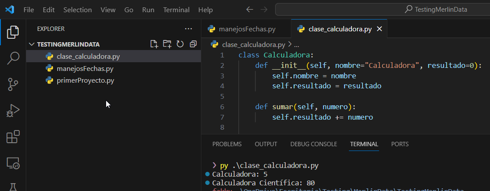

# 🐾 Damos Nuestros primeros pasos en Python🐍

Vamos a comenzar abriendo Visual Estudio Code, nos aparecera de la siguiente manera

hacemos click en **Open Folder** y creamos una carpeta donde colocaremos nuestro repositorio (ejemplo: "TestingMerlinData")y colocamos abrir.

> nota: podemos abrir VS Code desde la terminal, ubicandonos en el directorio de nuestro proyecto y colocando **"code ."**

Nos quedara de la siguiente manera:


---
- [x] Abrimos nuestro primer proyecto
- [ ] Creamos y Ejecutamos nuestro primer script en Python
---
## 👶Crearemos Nuestro Primer Script en Python
- en el incono ubicado en la esquina superior izquieda llamado "EXPLORER", nos aparecera la carpeta de nuestro proyecto con un icono de un archivo con un simbolo mas, como se ve en la siguiente imagen.

Hacemos click en este y colocamos "primerProyecto.py", esto no generara un nuevo archivo donde colocaremos nuestro codigo de python


<span style="color:red">Importante!</span>
 debemos recordar que nuestro archivo en python debe contener el siguiente formato nombre.py, ya que el `.py` representa archivos con codigo de python 


> #### En los siguiente ejemplos vamos a intentar utilizar tanto ciclos, como estructuras case para solucionar ciertas problematicas 

1. Dada una lista de Años `lista_de_anios = [2000, 2005, 2010, 2015, 2020, 2025, 2030, 2035, 2040]`, Utilizando el ciclo **while**, invertir el orden de la lista 
    ```python
    lista_de_anios = [2000, 2005, 2010, 2015, 2020, 2025, 2030, 2035, 2040]


    def invertir_lista_con_while(lista):
        inicio = 0
        fin = len(lista) - 1
        while inicio < fin:
            lista[inicio], lista[fin] = lista[fin], lista[inicio]
            inicio += 1
            fin -= 1
        return lista


    print(invertir_lista_con_while(lista_de_anios))
    ```
    para ver el funcionamiento paso a paso, si se nos dificulta, podemos acceder a [pytutor](https://pythontutor.com/visualize.html#mode=edit) y ejecutar el codigo, para ver paso a paso su funcionamiento.
    Damos en "Visualizar Ejecucion", y nos mostrara paso a paso como python ejecuta el codigo
    
    > nota: podemos utilizar rebanadas o slicing para simplificar el codigo 
    > quedando: 
    > lista_invertida = lista_de_anios[::-1]
    > pero en nuestro caso queriamos mostrar el funcionamiento del ciclo while

 - Para ejecutar un script vamos a dirigirnos a la esquina superior izquierda, y seleccionaremos **terminal**, al abrir colocaremos "**py primerProyecto.py**", como se ve en la siguiente imagen

 

 2. Dada un año, verificar si  este es par y mostrarlo por pantalla. Utilizando ciclo **for**
```python
lista_de_anios = [2000, 2005, 2010, 2015, 2020, 2025, 2030, 2035, 2040]


def mostrar_anios_par(anios):
    anios_pares = []
    for anio in anios:
        if anio % 2 == 0:
            anios_pares.append(anio)
    return anios_pares


print(mostrar_anios_par(lista_de_anios))
```

---
- [x] Abrimos nuestro primer proyecto
- [x] Creamos y Ejecutamos nuestro primer script en Python
- [ ] Manejo de Fechas con `time` y `datetime`
---

## 📅 Manejo de Fechas en Python
El siguiente código en Python utiliza la biblioteca `time` para realizar diversas operaciones relacionadas con fechas.

#### Obtener la Fecha y Hora Actual

```python
import time

fecha_actual = time.localtime()
print("Fecha y hora actual:", time.strftime("%Y-%m-%d %H:%M:%S", fecha_actual))
```

el comando `time.strftime(formato, fechaTime)` transforma la fecha en un `String`


#### Obtener el mes de la fecha en curso
Para obtener la fecha del mes, seguiremos con el ejemplo anterior, donde obtuvimos la fecha actual
La variable fecha_actual es del tipo `time.struct_time` y por este motivo tiene ciertas funciones que nos son de utilidad como por ejemplo:
* tm_mon: Mes (1-12)
* tm_year: Año
* tm_mday: Día del mes (1-31)
* tm_wday: Día de la semana (0 = lunes, 1 = martes, ..., 6 = domingo)
* tm_yday: Día del año (1-366)

Utilizaremos el ejemplo anterior y obtendremos el mes de la fecha
```python
mes_actual = fecha_actual.tm_mon
print("Mes de la fecha en curso:", mes_actual)
```
#### Operaciones sobre fechas ➕,➖,➗,✖️
hay situaciones en las cuales necesitamos sumar o restar dias, lamentablemente con la libreria `time` no es posible hacer esto, pero python nos provee otra libreria que nos facilita esto, llamada `datetime`

Para esto importaremos esta libreria y utilizaremos para obtener la fecha actual el comando `datetime.now()`
```python
from datetime import datetime, timedelta
fecha_actual_dt = datetime.now() 

dias_a_sumar = 5
nueva_fecha = fecha_actual_dt + timedelta(days=dias_a_sumar)
print(f"Fecha actual + {dias_a_sumar} días:", nueva_fecha.strftime("%Y-%m-%d %H:%M:%S"))

```

`timedelta` se usa para sumar días a esa fecha
`strftime` se utiliza para dar formato y transformar en `String` al tipo de dato

---
- [x] Abrimos nuestro primer proyecto
- [x] Creamos y Ejecutamos nuestro primer script en Python
- [x] Manejo de Fechas con `time` y `datetime`
- [ ] Generacion de datos Random
---

## 🎲 Generacion de datos Random
En este documento, exploraremos cómo generar datos aleatorios, como correos electrónicos y nombres, utilizando Python. También veremos cómo manipular y parsear estos datos según sea necesario.

#### Generar Correos Electrónicos Aleatorios 📨

Para generar correos electrónicos aleatorios, podemos combinar cadenas aleatorias con un dominio predefinido. Utilizaremos el módulo `random` para esto.

```python
import random
import string

def generar_correo_aleatorio():
    nombre = ''.join(random.choice(string.ascii_lowercase) for _ in range(8))
    dominio = random.choice(['gmail.com', 'yahoo.com', 'example.com'])
    return f"{nombre}@{dominio}"

correo_aleatorio = generar_correo_aleatorio()
print("Correo electrónico aleatorio:", correo_aleatorio)
```
vamos a explicar paso a paso lo que estamos haciendo en este codigo, primero la libreria `string` con su metodo **string.ascii_lowercase** nos devuelve una cadena de caracteres con las letras de la a-z en minuscula

**random.choice(parametro)** : recibe como parametro una arreglo, y de forma aleatoria devuelve 1 valor de este arreglo, en el caso de nuestro codigo selecciona una letra del abcedario

**for _ in range(8)** :  indica que se deben generar 8 caracteres. por lo que se repite 8 veces la seleccion de un caracter

**''.join(...)** :  combina los caracteres generados en una cadena de texto. El resultado es un nombre aleatorio de 8 caracteres.

### Otra forma de generar nombres aleatorios

podemos utilizar una lista de nombres y apellidos y combinarlos de manera aleatoria.

```python
def generar_nombre_aleatorio():
    nombres = ['Alice', 'Bob', 'Charlie', 'David']
    apellidos = ['Smith', 'Johnson', 'Williams', 'Jones']
    return f"{random.choice(nombres)} {random.choice(apellidos)}"

nombre_aleatorio = generar_nombre_aleatorio()
print("Nombre aleatorio:", nombre_aleatorio)
```

### Generación de Datos Realistas con la Librería Faker en Python

La librería Faker en Python ofrece una forma eficiente y realista de generar datos ficticios. Con Faker, podemos crear nombres, direcciones, correos electrónicos, números de teléfono, etc.
Lo más fascinante de esta librería es su capacidad para proporcionar datos personalizados según la región. Por ejemplo, si deseamos obtener datos en español y específicamente de Argentina, podemos instanciar Faker con el atributo ``"es_AR"``.


- #### generamos nombres y direcciones
faker nos permite crear datos de manera muy intuitiva
```python
from faker import Faker

fake = Faker("es_AR")
nombre = fake.name()
direccion = fake.address()
email = fake.email()
print(nombre)
print("-"*20)
print(direccion)
print("-"*20)
print(email)

#Otras
nombre = fake.first_name()
apellido = fake.last_name()
calle = fake.street_name()
numero = fake.building_number()
ciudad = fake.city()
```


> [Funciones de faker para datos personalizados en argentina](https://faker.readthedocs.io/en/master/locales/es_AR.html)


> [Documentacion faker general](https://faker.readthedocs.io/en/master/)


---
- [x] Abrimos nuestro primer proyecto
- [x] Creamos y Ejecutamos nuestro primer script en Python
- [x] Manejo de Fechas con `time` y `datetime`
- [x] Generacion de datos Random
- [ ] Parseo de Datos
---

## Parseo de Datos
muchas veces necesitamos separar una cadena de caracteres, por ejemplo tenemos el nombre y el apellido de una persona en una cadena de caracteres, y necesitamos utilizar solo el nombre, en este caso podemos utilizar el metodo **split()** que poseen los datos del tipo ``String`` 

```python

def parsear_nombre(nombre_completo):
    partes = nombre_completo.split()
    return {'nombre': partes[0], 'apellido': partes[1]}

info_nombre = parsear_nombre(nombre_aleatorio)
print("Información del nombre:", info_nombre)

```

el metodo **split()** si no se pasan parametros, toma por defecto el " "(espacio) y separa los datos que esten divididos por este.
por ejemplo "Juan Perez" nos quedaria un array de ["Juan", "Perez"]

luego de esto podemos trabajarlo como se ve en el ejemplo como un array 

### Otro ejemplo  

en este cado la divicion del dato que necesitamos esta separada por un guion medio, por lo tanto nuestro parametro en el metodo **split()** debe ser "-", como se ve en el ejemplo
```python
def parsear_dni(cuil):
    partes = cuil.split("-")
    return {'DNI': partes[1]}

# Ejemplo
cuil= "20-12345678-9"
info_DNI = parsear_dni(cuil)
print(info_DNI)
```

---
- [x] Abrimos nuestro primer proyecto
- [x] Creamos y Ejecutamos nuestro primer script en Python
- [x] Manejo de Fechas con `time` y `datetime`
- [x] Generacion de datos Random
- [x] Parseo de Datos
- [ ] Manejo de clases en python 
---
# Manejo de Clases en Python
Una clase es un modelo o plantilla que define atributos y comportamientos de una entidad.

Se utilizan para encapsular datos y funciones relacionadas en una única entidad. En este apartado, exploraremos cómo trabajar con clases en Python, abordando la creación, la instanciación y el uso práctico.

```python
class Calculadora:
    def __init__(self, nombre="Calculadora", resultado=0):
        self.nombre = nombre
        self.resultado = resultado

    def sumar(self, numero):
        self.resultado += numero

    def restar(self, numero):
        self.resultado -= numero

    def multiplicar(self, numero):
        self.resultado *= numero

    def obtener_resultado(self):
        return self.resultado


# Intanciamos 2 calculadoras con distintos nombre y resultado inicial
calculadora_basica = Calculadora()
calculadora_cientifica = Calculadora(nombre="Calculadora Científica", resultado=100)

# Utilizando Instancias
calculadora_basica.sumar(5)
calculadora_cientifica.restar(20)

# Mostrar resultados
print(f"{calculadora_basica.nombre}: {calculadora_basica.obtener_resultado()}")
print(f"{calculadora_cientifica.nombre}: {calculadora_cientifica.obtener_resultado()}")
```


---
### En este documento logramos ver los siguientes temas! 

---
- [x] Abrimos nuestro primer proyecto
- [x] Creamos y Ejecutamos nuestro primer script en Python
- [x] Manejo de Fechas con `time` y `datetime`
- [x] Generacion de datos Random
- [x] Parseo de Datos
- [x] Manejo de clases en python 
---