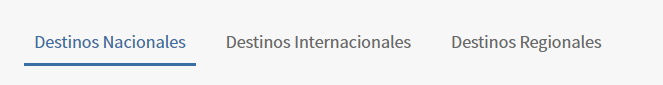
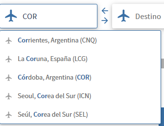

# Elementos Web - Listas

En una pagina web nos podemos encontrar distintos tipos de elementos, hasta el momento analizamos los siguientes:
- Caja de texto (input)
- texto (lebel) 
- botones (button)

Pero ademas de estos existen mas elementos, como listas que pueden estar desplegadas o pueden ser desplegables


#### Listas

Como mencionamos anteriormente, existen 2 tipos de listas

- Listas Desplegadas:
    

- Listas Desplegables:
    

En ambos casos se trabajan de la misma manera, pero hay que tener en cuenta que las listas desplegables estaran disponibles una vez sean desplegadas...


```python
    list_locator_origen_destino = (By.XPATH, "//ul[@role='listbox']//li[@role='option']")

    ####....

    @allure.step('Seleccionar origen')
    def seleccionar_lista_opciones(self, origen):
        WebDriverWait(self.driver, 10).until(
            EC.presence_of_element_located(self.list_locator_origen_destino)
        )
        elementos_destino_origen = self.driver.find_elements(*self.list_locator_origen_destino)

        for elemento in elementos_destino_origen:
            if origen in elemento.text:
                elemento.click()
                break
```

**elementos_destino_origen**: devuelve una lista con cada uno de los elementos que tengan ese locator, esta lista es de webElement


En ocaciones en nuestras paginas web nos encontraremos con etiquetas `Select`
```html
<select id="searchLanguage" name="language">
    <option value="af" lang="af">Afrikaans</option><!-- Afrikaans -->
    <option value="ca" lang="ca">Català</option>
    <option value="cy" lang="cy">Cymraeg</option><!-- Cymraeg -->
    <option value="da" lang="da">Dansk</option>
    <option value="de" lang="de">Deutsch</option>
    <option value="en" lang="en" selected="selected">English</option><!-- English -->
    <option value="es" lang="es">Español</option>
    <option value="eo" lang="eo">Esperanto</option>
    <option value="eu" lang="eu">Euskara</option>
    <option value="fr" lang="fr">Français</option><!-- français -->
    <option value="gl" lang="gl">Galego</option>
    <option value="hr" lang="hr">Hrvatski</option>
    <option value="id" lang="id">Bahasa Indonesia</option>
    <option value="it" lang="it">Italiano</option>
</select>

```
y a estas etiquetas selenium las trata de un matera diferente

```python
select_locator=(By.ID, "searchLanguage']")
def seleccionar_opcion(driver, valor):
    """
    Función para seleccionar una opción de un elemento <select> utilizando su valor.
    
    :param driver: Instancia del navegador WebDriver.
    :param valor: Valor de la opción que se desea seleccionar.
    """
    select_element = Select(driver.find_element(*select_locator))
    select_element.select_by_value(valor)
```

Podran encontrar mas informacion sobre el uso de select [Aqui](https://selenium-python.readthedocs.io/api.html#module-selenium.webdriver.support.select)
