# Manejo de Jenkins
En este documento abordaremos distintas formas de manejar jenkins para hacer que nuestro proyecto sea de integracion continua (CI)

Lo primero que debemos hacer es instalarlo

### Instalacion:
1. Nos dirigimos a la pagina oficial de [jenkins](https://www.jenkins.io/)
2. Seleccionamos en la pestaña de "**Download**"
3. Seleccionamos la opcion que corresponda a nuestro sistema operativo (siempre la version LTS)
    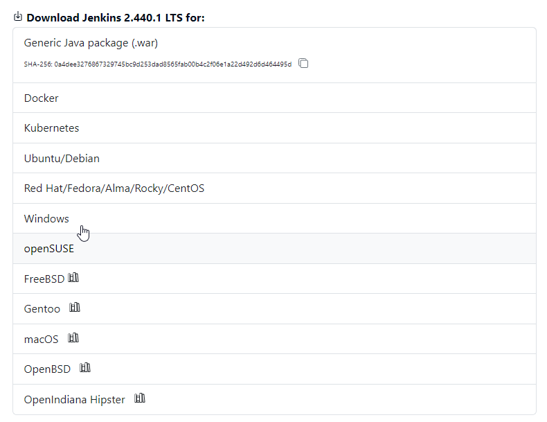
4. Nos dirigimos a la carpeta de "**Descargas**" y sobre el archivo llamado `jenkins.msi` hacemos doble click para iniciar la instalacion
    
    - Colocamos la ubicacion del archivo por ejemplo: **C:\Program File\Jenkins** y le damos al boton `Next`
    - Colocaremos la opcion **Run Service as LocalSystem**
    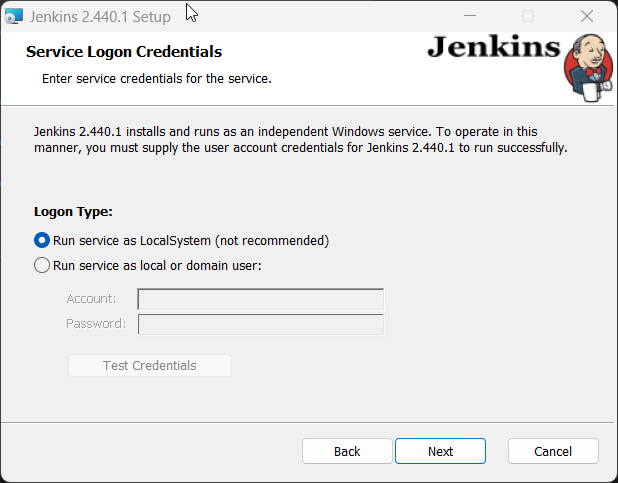
    - Seleccionamos el numero de puerto en donde estara activo nuestro jenkins (por defecto 8080)
    - Debemos colocar la ruta donde esta alojado nuestro jdk de java
    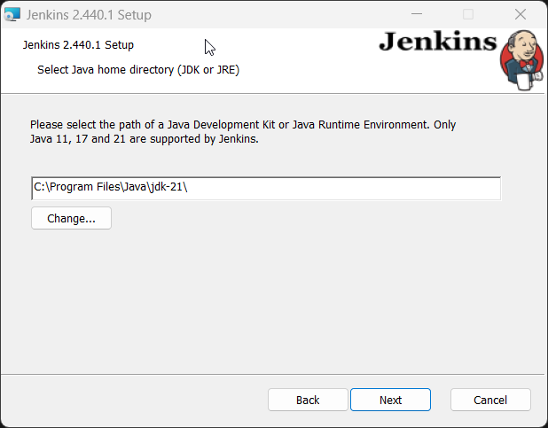
    - Luego el resto de configuraciones las dejamos por defecto, y hacemos click en instalar.

5. Verificamos si efectivamente nuestro jenkins esta funcionando
    
    - Vamos al navegador y accedemos a la ruta  http://localhost:8080 (o el puerto que colocamos 
        en la instalacion), nos encontraremos con el jenkins bloqueado
        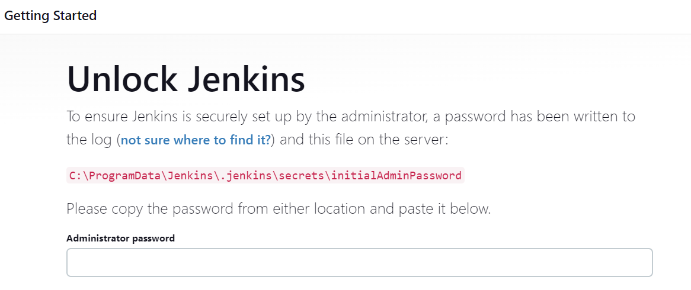
        Accedemos a la ruta que nos indica en rojo, esto nos abrira un block de notas y copiaremos su contenido, a este lo colocamos como contraseña y damos en continuar
    
    - Nos apareceran 2 opciones, de estas seleccionamos la que dice **Install suggested plugins** Y esperamos a que se terminen de instalar los plugins sugeridos.
    
    - Al finalizar la instalacion de los plugins, nos solicitara la creacion del usuario administrador, completamos y damos en continuar

    - Nos aparecera para configurar la ruta, la dejamos por defecto y damos en **Save and Finish** y en **Start using Jenkins**

6. Nos dirigimos en ``Administrar Jenkins`` y vamos a la seccion `Plugins>Available plugins`
    
    - buscamos `allure ` e instalamos, al finalizar, marcamos la opcion para reiniciar jenkins.


### Creacion de nuestro primer jobs

##### <span style="color: red">Importante tener subido el proyecto en algun sistema de control de versiones!! </span>

1. En la pagina de inicio haremos click en la opcion para `Nueva Tarea` 

2. Colocaremos un nombre y seleccionaremos la opcion `Crear un proyecto de estilo libre`  y damos en `Ok`
    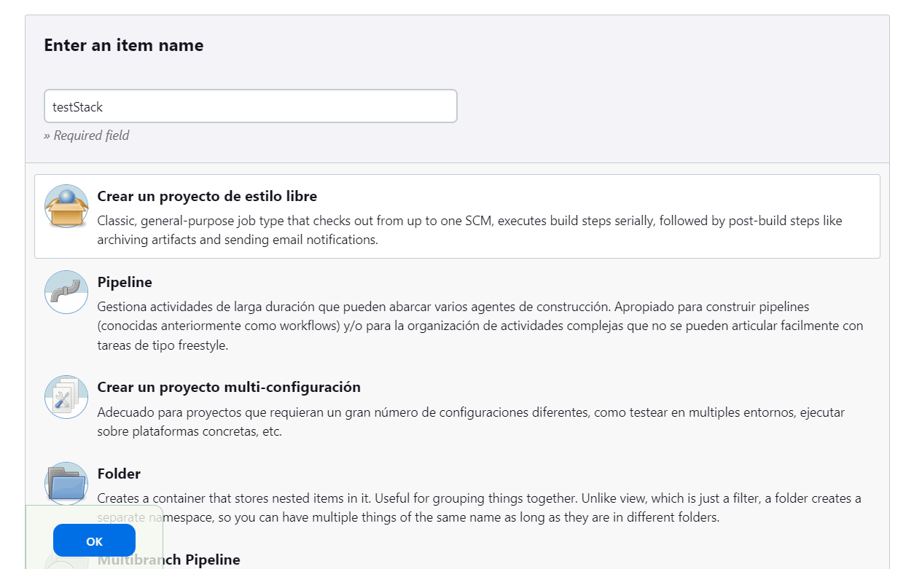
3. Nos apareceran 6 apartados:
    
    1. General: 
        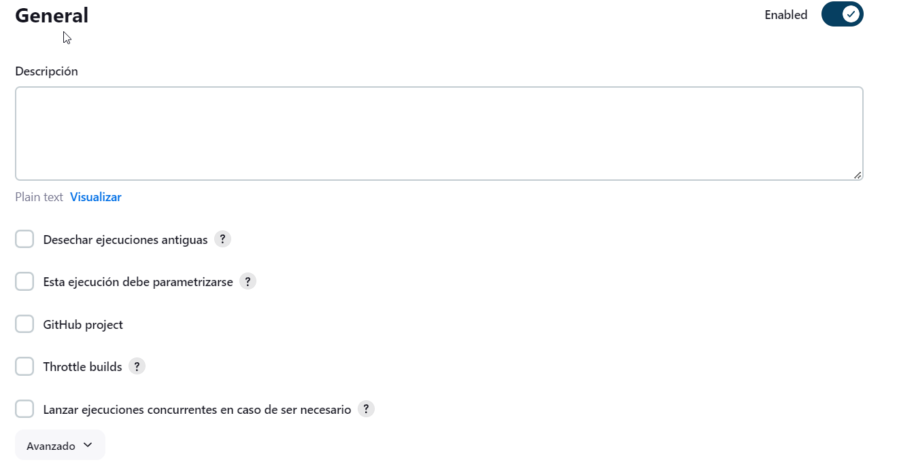
        ##### <span style="color: blue">Marcamos `desechar ejecuciones antiguas` </span>
        - ``Descipcion``: aqui agregaremos alguna descripcion significativa del proyecto
        - ``Desechar ejecuciones antiguas``: Permite desechar automaticamente las ejecuciones antiguas, para mantener el historial limpio
        - ``GitHub project``: Si estamos trabajando con GitHub podemos marcar esta opcion y asociar el repositorio
        - ``Throttle builds``: Esta opcion nos permite limitar las ejecuciones simultaneas
        - ``Lanzar ejecuciones concurrentes en caso de ser necesario``: le permite a jenkins ejecutar los trabajos de forma simultanea si este lo considera necesario

    2. Configuración de código fuente:
        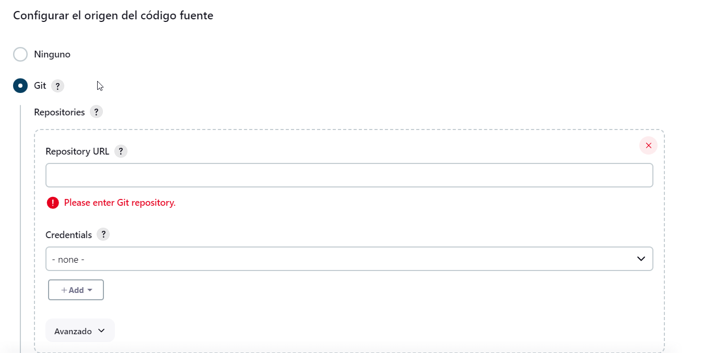
        
        ##### <span style="color: blue">Marcamos `Git` </span>
        - Marcamos la opcion Git y en este agregaremos la url de nuestro repositorio, pero ademas en el apartado **Branch Specifier (blank for 'any')** colocaremos la que corresponda, si estamos en GitHub la rama por defecto es `*/main`
    
    3. Disparadores de ejecuciones
        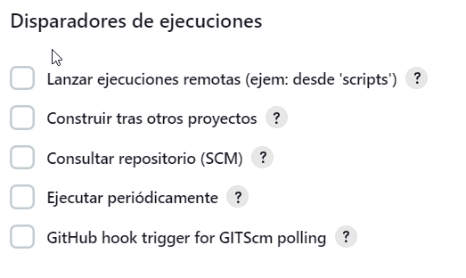
        ##### <span style="color: blue">No marcamos ninguna opcion</span>

        - ``Lanzar ejecuciones remotas (ejem: desde 'scripts')``: Permite iniciar ejecuciones de
            este trabajo de forma remota.
    	- ``Construir tras otros proyectos``: Permite la construccion tras la ejecucionde otro proyecto
    	- ``Consultar repositorio (SCM)``: Configura Jenkins para que verifique el repositorio de  
            código fuente en busca de cambios antes de iniciar una ejecución.
    	- ``Ejecutar periódicamente``: Programa ejecuciones segun parametro.
    	- ``GitHub hook trigger for GITScm polling``: Configura Jenkins para que se active cuando se 
            detecten cambios en el repositorio de GitHub(hay que configurar el GitHub).
    	        
    4. Entorno de ejecución:
        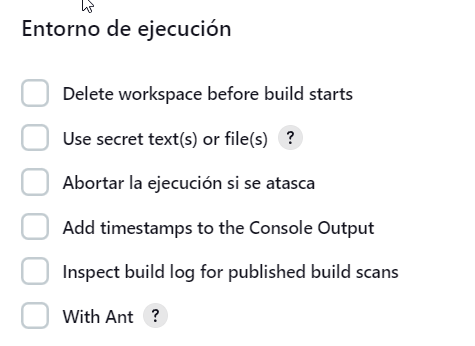
        ##### <span style="color: blue">Marcamos `Delete workspace before build starts`</span>
        - ``Delete workspace before build starts``: Borra el espacio de trabajo al iniciar cada ejecucion
        - `Use secret text(s) or file(s)`: permite el uso de archivos o textos secretos en la configuracion del trabajo
        - `Abortar la ejecución si se atasca`: Cancela la ejecucion si el trabajo esta atascado o no progresando
        - ``Add timestamps to the Console Output``: Agrega datos de tiempo para mantener un registro
        - `Inspect build log for published build scans`:  Permite a Jenkins inspeccionar los registros de construcción
        - `With Ant`: Permite utilizar Apache Ant
    
    5. Build Steps: En esta opcion agregaremos los pasos que debe hacer jenkins(notar que son los mismos que ejecutariamos nostros al clonar el repositorio)
        
        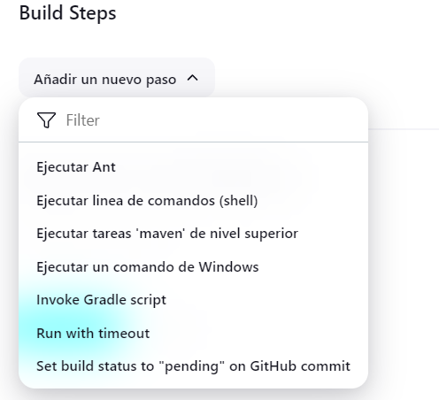
        
        - **paso 1**: ```python -m venv venv```
        - **paso 2**: `venv/Scripts/activate`
        - **paso 3**: `pip install -r requirements.txt`
        - **paso 4**: `python -m pytest --browser=chrome --ambiente=qa`
    

    6.  Acciones para ejecutar después.
            ##### <span style="color: blue">Marcamos la opcion Allure Report</span>
        - en el path colocaremos la ruta donde se encuentran los reportes
        `reports/allure-results`

        - Nos aparecera en rojo para configurar el comando global de allure, damos click en **Global Tool Configuration.**
        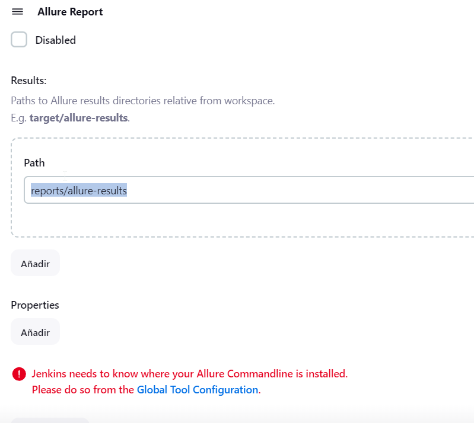

        - bajamos y encontramos una opcion llamada `Allure` lo configuramos de la siguiente manera
        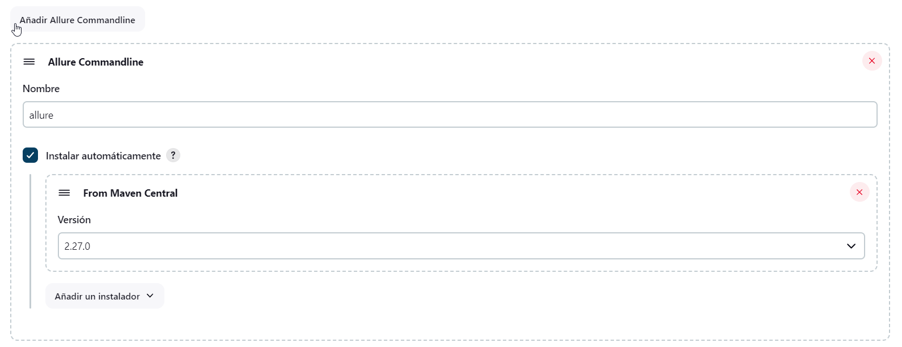

    Damos en guardar y nos vamos a construir el proyecto

    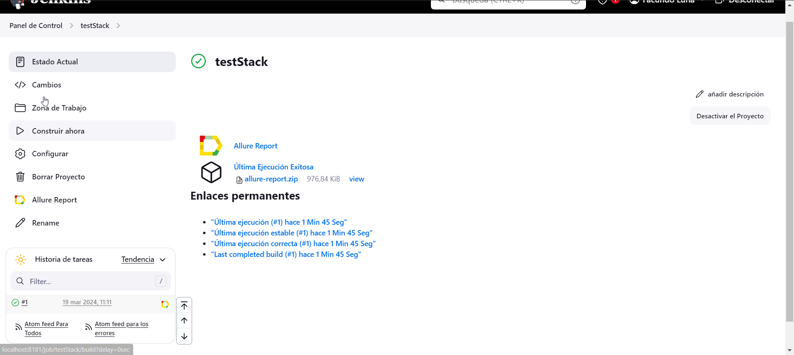