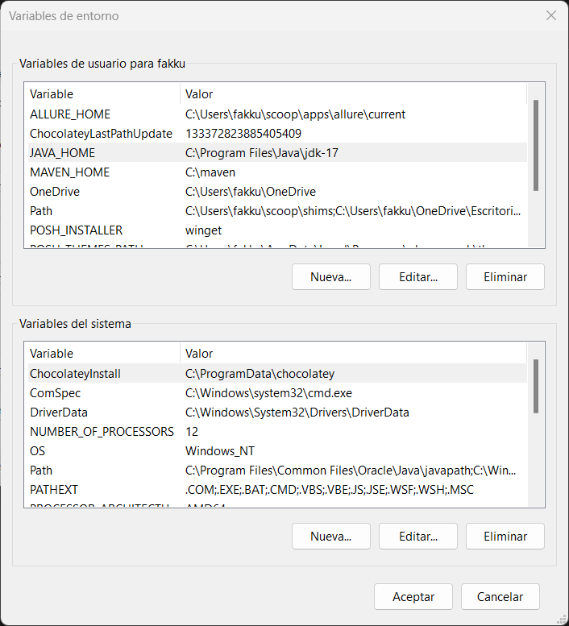
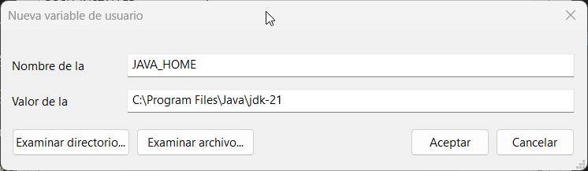

# Primer proyecto con python, pytest y selenium

---
- [ ] PreCondiciones(entorno virtual, instalacion de allure)
---

## Precondiciones
#### Creacion de entorno virtual paso a paso
1. Vamos a comenzar creando un entorno virtual con el comando 
    ```bash
    python -m venv autoTest
    ```
2. luego vamos a crear un archivo llamado "**requirements.txt**" con el siguiente texto, en este contendra las dependencias que necesitamos en el proyecto
    ```bash
    pytest
    selenium
    webdriver-manager
    allure-pytest
    pytest-xdist
    faker
    ```
    **pytest**:Framework de pruebas unitarias que permite escribir tests de manera sencilla y escalable en Python.
    **selenium**: Herramienta de automatización de navegador web para realizar pruebas funcionales en aplicaciones web.
    **webdriver-manager**: Gestor de controladores de navegadores para Selenium, simplificando la gestión de versiones y descargas.
    **allure-pytest**: Integración de Allure, un marco de informes visual, con pytest para generar informes detallados de pruebas.
    **pytest-xdist**: Plugin para pytest que proporciona funcionalidades adicionales, como la ejecución paralela de pruebas.
    **faker**: Biblioteca que permite generar datos falsos de manera realista para pruebas y desarrollo.

3. Activamos el entorno virtual y instalamos las dependencias
    - en windows:
        ```bash
        autoTest\Scripts\activate
        ```
    - en linux:
        ```bash
        source autoTest\bin\activate
        ```
    
    y instalamos
    ```bash
    pip install -r requirements.txt
    ```

#### Instalacion de java 
Para hacer uso de allure debemos tener java instalado, por lo cual vamos a acceder a la [pagina oficial de Java](https://www.oracle.com/ar/java/technologies/downloads/#jdk21-windows)


Seleccionamos la opcion del medio, notando que esta finaliza con .exe

La ejecutamos e instalamos

- Ahora necesitamos agregar la variable de entorno 
    1. Hacemos click en el icono de windows, y en el buscador colocamos `variables de entorno del sistema`
    2. En la ventana que se abre, hacemos click en el boton inferior que se llama `variables de entorno...`
        
    3. En la ventana que se abre, debemos hacer click en `Nueva` y agregamos lo que se ve en las siguientes imagenes
        
        


#### instalacion de allure
1. en windows
    - Instalar Scoop
    
        1. Abre PowerShell como administrador.
    
        2. Ejecuta el siguiente comando para instalar Scoop:
        ```powershell
        iex (new-object net.webclient).downloadstring('https://get.scoop.sh')
        ```
        > si no funciona colocar: **iex "& {$(irm get.scoop.sh)} -RunAsAdmin"**
        3. Configura la ejecución de scripts:
    
        ```powershell
        Set-ExecutionPolicy RemoteSigned -scope CurrentUser
        ```
    
    - Instalar Allure con Scoop
        Ejecuta el siguiente comando para instalar Allure:
    
        ```bash
        scoop install allure
        ```
    
    - Verificar la instalacion
        Ejecuta para verificar la instalación:
    
        ```bash
        allure --version
        ```
2. en linux

    - descargamos el archivo .deb para instalarlo [link](https://github.com/allure-framework/allure2/releases/tag/2.27.0)
    - colocamos en la consola para instalarlo 
    ```bash
    sudo dpkg -i allure_2.27.0-1_all.deb
    ```
    - verificar la instalacion
    ```bash
    allure --version
    ``` 
    > nos puede llegar a pedir tener java instalado para eso solo debemos instalar java
    > **"sudo apt install openjdk-17-jdk"**


---
- [x] PreCondiciones(entorno virtual, instalacion de allure)
- [ ] Creacion de estructura de carpetas
---

## Estructura de carpetas

Organizaremos el proyecto en varias carpetas, cada una con un propósito específico:

- **autoTest:** Carpeta creada al configurar el entorno virtual con venv.

- **config:** Contiene archivos de configuración para la automatización de pruebas.

- **img:** Almacena imágenes relacionadas con el proyecto o a la documentacion.

- **pages:** Contiene archivos que representan las páginas o componentes a probar.

- **reports:** Aquí se generarán los informes de las pruebas realizadas.

- **test:** Contiene los casos de prueba.

- **utils:** Carpeta para utilidades y funciones auxiliares.

#### Archivos Importantes

- **.gitignore:** Especifica los archivos y carpetas que deben ser ignorados por el sistema de control de versiones Git.

- **pytest.ini:** Archivo de configuración para pytest.

- **README.md:** Documentación principal del proyecto.

- **requirements.txt:** Lista de dependencias del proyecto.

> Documentacion sobre Hook en Pytest [Aqui](https://pytest.org/en/7.4.x/how-to/writing_plugins.html#pytest-hook-reference) !IMPORTANTE! para entender conftest.py


---
- [x] PreCondiciones(entorno virtual, instalacion de allure)
- [x] Creacion de estructura de carpetas
- [ ] Creacion del primer Script
---

### Ahora si Creamos nuestro primer script

1. nos dirigimos a la carpeta test y creamos nuestro primer archivo .py con el nombre "**test_case_stack.py**"


2. agregaremos la siguiente seccion de codigo
    ```python
    import pytest
    from selenium import webdriver
    from selenium.webdriver.common.by import By
    from selenium.webdriver.common.keys import Keys
    from webdriver_manager.chrome import ChromeDriverManager
    from selenium.webdriver.chrome.service import Service
    from time import sleep


    class Test:

        btn_aceptar_cookies = (
            By.XPATH, "//button[@id='onetrust-accept-btn-handler']")
        txt_caja_busqueda    = (By.XPATH, "//input[@placeholder='Buscar…']")
        #buscador = (By.XPATH, "//input[@name='q']")

        def test_busqueda(self):
            driver = webdriver.Chrome(service=Service(
                ChromeDriverManager().install()))
            driver.get("https://es.stackoverflow.com/")
            btn_cookies = driver.find_element(*self.btn_aceptar_cookies)
            assert btn_cookies.is_displayed()
            btn_cookies.click()
            caja_busqueda = driver.find_element(*self.buscador)
            assert caja_busqueda.is_displayed()
            caja_busqueda.clear()
            caja_busqueda.send_keys("python")
            caja_busqueda.send_keys(Keys.ENTER)
            sleep(5)
            assert "python" in driver.title


    if __name__ == "__main__":
        pytest.main()
    ```

3. abriendo la terminal y colocando
    ```bash
    pytest -v -s .\test\test_case_stack.py
    ```


---
- [x] PreCondiciones(entorno virtual, instalacion de allure)
- [x] Creacion de estructura de carpetas
- [x] Creacion del primer Script
- [ ] Visualizacion de pruebas con Allure
---

#### Visualizacion con Allure

Vamos a agregar comentarios para poder visualizar el resultado de nuestras pruebas

1. vamos a editar el codigo anterior, agregando un par de comentarios para mostrar como se visualizan estos
    ```python
    import pytest
    import allure
    from selenium import webdriver
    from selenium.webdriver.common.by import By
    from selenium.webdriver.common.keys import Keys
    from webdriver_manager.chrome import ChromeDriverManager
    from selenium.webdriver.chrome.service import Service
    from time import sleep


    class Test:

        btn_aceptar_cookies = (
            By.XPATH, "//button[@id='onetrust-accept-btn-handler']")
        buscador = (By.XPATH, "//input[@placeholder='Buscar…']")

        @allure.title("Validar busqueda en stackoverflow")
        @allure.description("Validar que se pueda buscar en stackoverflow")
        def test_busqueda(self):
            driver = webdriver.Chrome(service=Service(
                ChromeDriverManager().install()))
            driver.get("https://es.stackoverflow.com/")
            with allure.step("Validar que se muestre el boton de aceptar cookies"):
                btn_cookies = driver.find_element(*self.btn_aceptar_cookies)
                assert btn_cookies.is_displayed()
            with allure.step("Aceptar cookies"):
                btn_cookies.click()
            with allure.step("Validar que se muestre el buscador"):
                caja_busqueda = driver.find_element(*self.buscador)
                assert caja_busqueda.is_displayed()

            with allure.step("Realizar busqueda"):
                caja_busqueda.clear()
                caja_busqueda.send_keys("python")
                caja_busqueda.send_keys(Keys.ENTER)
            sleep(3)
            with allure.step("Validar que se muestre el resultado de la busqueda"):
                assert "python" in driver.title


    if __name__ == "__main__":
        pytest.main()
    ```
2. vamos a ejecutarlo con el siguiente comando:
    ```bash
    pytest -vs .\test\test_case_stack.py --alluredir reports/allure-results
    ```
3. para visualizarlo por allure debemos colocar en la terminal
    ```bash
    allure serve .\reports\allure-results
    ```
---
- [x] PreCondiciones(entorno virtual, instalacion de allure)
- [x] Creacion de estructura de carpetas
- [x] Creacion del primer Script
- [x] Visualizacion de pruebas con Allure
- [ ] Agregamos fixture al test
---

#### Agregamos el uso de Fixture
En python con la biblioteca pytest, tenemos la opcion de usar el decorador `@pytest.fixture` 


```python
import pytest
import allure
from selenium import webdriver
from selenium.webdriver.common.by import By
from selenium.webdriver.common.keys import Keys
from webdriver_manager.chrome import ChromeDriverManager
from selenium.webdriver.chrome.service import Service
from selenium.webdriver.support.ui import WebDriverWait
from selenium.webdriver.support import expected_conditions as EC


class Test:

    btn_aceptar_cookies = (
        By.XPATH, "//button[@id='onetrust-accept-btn-handler']")
    buscador = (By.XPATH, "//input[@placeholder='Buscar…']")

    @pytest.fixture(autouse=True)
    def setup_teardown(self):
        self.driver = webdriver.Chrome(
            service=Service(ChromeDriverManager().install())
        )
        self.driver.maximize_window()
        self.driver.get("https://es.stackoverflow.com/")

        yield  # Lo que este despues de yield se ejecuta despues de cada test

        print("Cerrar Browser")
        self.driver.quit()

    @allure.title("Validar busqueda en stackoverflow")
    @allure.description("Validar que se pueda buscar en stackoverflow")
    def test_busqueda(self):
        driver = self.driver

        WebDriverWait(driver, 10).until(
            EC.element_to_be_clickable(self.btn_aceptar_cookies))

        with allure.step("Validar que se muestre el boton de aceptar cookies"):
            btn_cookies = driver.find_element(*self.btn_aceptar_cookies)
            assert btn_cookies.is_displayed()

        with allure.step("Aceptar cookies"):
            btn_cookies.click()

        WebDriverWait(driver, 10).until(
            EC.visibility_of_element_located(self.buscador))

        with allure.step("Validar que se muestre el buscador"):
            caja_busqueda = driver.find_element(*self.buscador)
            assert caja_busqueda.is_displayed()

        with allure.step("Realizar busqueda"):
            caja_busqueda.clear()
            with allure.step("Validamos que la caja de busqueda este vacia"):
                assert caja_busqueda.get_attribute("value") == ""

            with allure.step("Validamos que el len de la caja de busqueda sea 0"):
                assert len(caja_busqueda.get_attribute("value")) == 0

            caja_busqueda.send_keys("python")
            with allure.step("Validamos que la caja de busqueda contenga la palabra python"):
                assert caja_busqueda.get_attribute("value") == "python"

            caja_busqueda.send_keys(Keys.ENTER)

        with allure.step("Validar que se muestre el resultado de la busqueda"):
            assert "python" in driver.title


if __name__ == "__main__":
    pytest.main()

```

lo ejecutamos con:
```bash
pytest -vs .\test\test_case_stack.py --alluredir reports/allure-results
```

y visualizamos con:
```bash
allure serve .\reports\allure-results
```


### En este documento vimos!

---
- [x] PreCondiciones(entorno virtual, instalacion de allure)
- [x] Creacion de estructura de carpetas
- [x] Creacion del primer Script
- [x] Visualizacion de pruebas con Allure
- [x] Agregamos fixture al test
---